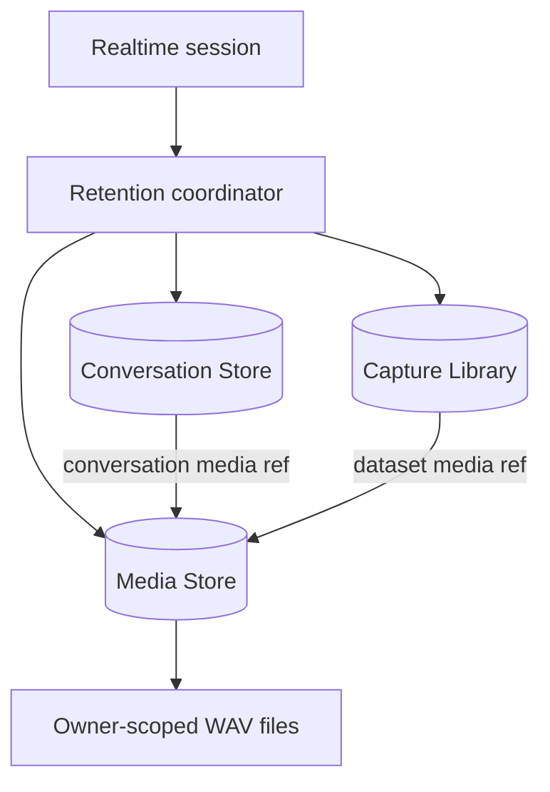

# Conversation retention and media architecture

Status: Accepted design; conversation-only retained-media backend and protected
download API delivered, shared Library media and replay UI pending, 2026-08-06.

This document defines how VoxStudio records an Agent conversation, how optional
input and output audio is retained, and how that data relates to the existing
ASR Capture Library. It is the implementation contract for retained-audio replay
in Agent Builder Conversations.

The governing rule is simple: **a conversation record, an audio object, and a
curated dataset item are different resources**. They may refer to one another,
but enabling, listing, deleting, or expiring one must not silently change the
policy of another.

## Goals

- reconstruct the text, timing, lifecycle, and exact Agent version of a retained
  conversation;
- optionally replay the finalized user utterances and Agent audio associated
  with each turn and revision;
- preserve interruption and speculative-reopen history instead of overwriting
  it with the final revision;
- keep metadata, content, input audio, and output audio as independent opt-ins;
- keep persistence completely off by default and force sensitive retention off
  in public demo and future Portal deployments;
- keep file I/O, encoding, and retention work out of the realtime audio path;
- enforce ownership, deletion, time, count, and byte ceilings as storage
  invariants rather than UI conventions;
- retain the Capture Library's purpose as an ASR/voice dataset workflow.

## Non-goals

- recording raw microphone input before browser AEC, resampling, or endpointing;
- claiming that audio submitted to a socket was necessarily heard by a person;
- packet-level wire capture for every protocol dialect;
- call-center compliance policy, consent collection, or jurisdiction-specific
  recording notices;
- permanent archival, legal hold, analytics warehousing, or external object
  storage in the first implementation;
- changing the certified turn-taking, ASR, LLM, or TTS behavior.

Deployers remain responsible for obtaining any consent required to record a
conversation. VoxStudio must expose the effective retention policy clearly, but
must not imply that configuration alone satisfies that obligation.

## Current state and gap

The delivered Trace Store is an owner-scoped SQLite event and conversation
store. It records the exact Agent draft revision or immutable published version
and behavior hash. Metadata retention is enabled with `--traces DIR`, and
content is a separate opt-in through `--trace-content`. Time- and count-based
retention are enforced. Directional audio retention is now available through
`--trace-audio`, with a deployment-wide byte ceiling through
`--trace-max-bytes`; both remain off by default and demo mode forces audio off.

The Capture Library remains a separate explicit opt-in. For every VAD-finalized
user utterance, `packages/conversation` now emits a synchronous
`FinalizedInputAudio` with session, turn, revision, format, and WAV immediately
before ASR submission. After ASR it emits the structured `FinalizedUtterance`
with the raw transcript for the dataset workflow. This split means a speculative
reopen that cancels ASR cannot erase an input revision already submitted; the
legacy Library schema still stores only its session id and has not yet moved
onto shared Media assets.

When output retention is enabled, Agent PCM successfully submitted to the active
protocol sink is incrementally finalized as a WAV. Delivery is labeled `sent`,
`playback_acknowledged`, or `interrupted`; it still cannot generally prove that a
listener heard the audio.

Conversation deletion now uses a durable `deleting` marker, refuses an active
session with `409 conversation_active`, removes WAV bytes before acknowledging
success, and resumes an incomplete cleanup on startup or the next retention
sweep. The runtime byte ceiling evicts the oldest completed conversations before
refusing media from the protected active session.

This leaves three follow-up gaps:

1. a Trace policy reporting `audio: false` does not mean no VoxStudio component
   retained user audio, because the independently enabled Library may have done
   so;
2. existing Library WAVs cannot be mapped reliably to a turn or speculative
   revision from `session_id` alone;
3. Agent Builder does not yet render the retained descriptors or playback
   controls, although the owner-checked WAV endpoint is available.

## Decisions

### 1. Conversation Store owns facts; Media Store owns bytes

The existing Trace Store evolves into the Conversation Store. It continues to
own conversations, turns, immutable events, transcripts when enabled, exact
Agent identity, timing, and retention policy snapshots. Large audio bytes do
not enter SQLite.

A new Media Store owns audio files and their technical metadata. Conversation
and Library records refer to Media assets through typed, owner-scoped
references. An asset is physically deleted only after its last reference is
removed.

The name `TraceStore` may remain in code during migration, but the public model
is a retained conversation, not a debugging trace.



### 2. The Capture Library remains a dataset, not conversation history

Library-specific data stays on the Capture record: raw and corrected
transcripts, re-transcription results, promotion state, and curated/pinned
status. Conversation-specific data stays on the turn or event: Agent identity,
revision, timing, interruption, and delivery state.

When both input-audio retention and Library capture are enabled, the retention
coordinator creates one Media asset and two typed references. Removing the
conversation reference does not remove the curated Capture; removing the
Capture does not remove retained conversation audio.

The Conversation UI must never reveal a Library-only asset when conversation
input-audio retention was disabled. The Library may still show it under its own
explicit policy and authorization boundary.

### 3. Every audio object belongs to a turn and revision

Conversation media must not depend on ASR completing. Its early observer
receives at least:

```ts
interface FinalizedInputAudio {
  sessionId: string;
  turnId: string;
  revision: number;
  wav: Uint8Array;
  sampleRate: number;
  channels: number;
}
```

The later Library observer adds `rawTranscript`. The exact shapes may follow
existing package conventions, but `turnId` and `revision` are mandatory. A
speculative reopen creates another immutable utterance revision; it does not
mutate or reuse the prior Media association, even when the earlier ASR request
is cancelled before returning text.

Agent output is also keyed by `(sessionId, turnId, revision)`. An interrupted or
superseded response remains inspectable when its class was retained. The final
response is identified by state, not by deleting earlier attempts.

### 4. Retained input and output have precise meanings

Retained **input audio** is the VAD-finalized, canonical WAV submitted to ASR
after endpoint processing and resampling. It is not the browser's raw microphone
stream.

Retained **output audio** is the canonical TTS PCM submitted to the active
protocol sink for playback, finalized as a replayable WAV. A protocol adapter
may subsequently resample or encode that PCM for its wire format; retained
audio is not a packet capture.

For output, the model distinguishes:

- `generated`: TTS produced samples;
- `sent`: samples were handed to the active protocol transport;
- `playback_acknowledged`: a capable client reported playback completion;
- `interrupted`: playback was stopped before normal completion;
- `superseded`: a newer revision replaced this response.

`sent` never means `heard`. Protocols without playback acknowledgement can
report only the transport boundary. The UI labels those states honestly.

### 5. Retention classes remain independent and default off

The effective conversation policy has four independently readable classes:

| Class | Examples | Default |
|---|---|---|
| metadata | session id, Agent version, times, outcome | off |
| content | transcripts, tool payloads, raw event content | off |
| input audio | finalized user utterance WAVs | off |
| output audio | Agent playback WAVs | off |

Enabling content does not enable audio. Enabling output audio does not enable
input audio. Audio cannot be enabled without metadata because it would otherwise
be unidentifiable and undeletable.

The initial CLI surface is:

```text
--traces DIR
--trace-content
--trace-audio input|output|both
--trace-retention-days DAYS
--trace-max-conversations COUNT
--trace-max-bytes SIZE
```

`VOX_GATEWAY_*` environment equivalents follow the existing naming convention.
Omitting `--trace-audio` means no conversation audio. Supplying it without
`--traces` is a startup error rather than a silent no-op.

The deployment configuration is a ceiling. A future Agent or session option may
disable a retained class, but an untrusted client must never enable a class the
deployment did not authorize. Demo mode and the future public Portal force
content, input audio, and output audio off regardless of other flags.

Every Conversation stores an immutable snapshot of the effective policy. This
makes later UI and deletion behavior explainable even after gateway settings
change.

### 6. Retention must never interfere with conversation quality

All database and media operations are asynchronous observers of the realtime
session. They must not delay ASR submission, TTS delivery, interruption, or
socket writes.

The Media writer uses a bounded queue. On overload, I/O failure, or quota
failure, it abandons that recording, removes any temporary file, records a
structured `missing` or `truncated` media state when metadata persistence is
available, and lets the conversation continue. It must not accumulate an
unbounded in-memory session buffer.

Output is written incrementally to a temporary PCM/WAV file. Finalization patches
the WAV header, fsyncs where required by the existing durability policy, and
atomically renames the file. Abort and interruption finalize the prefix that was
actually submitted to the sink. A zero-sample rendition creates no Media asset.

Input already arrives as a bounded utterance WAV and may be enqueued as one
unit. The retention coordinator fans the resulting asset out to Conversation
and Library references according to their independent policies.

## Domain model

### Conversation

One retained realtime session, owner-scoped by the same `AuthContext.userId` as
Agents. It includes:

- `session_id` and owner id;
- start/end time, duration, outcome, and terminal error summary;
- exact Agent id, draft revision or published version, and behavior hash;
- engine route/capability snapshot where already exposed;
- effective retention-policy snapshot;
- aggregate byte/media state for list rendering and retention decisions.

### Turn

A stable logical exchange identified by `(session_id, turn_id)`. A Turn may have
multiple user utterance revisions and multiple Agent response renditions because
of speculative ASR, reopen, retry, or interruption. Turn state is derived from
immutable lifecycle events; it does not erase unsuccessful history.

### User utterance revision

An immutable row keyed by `(session_id, turn_id, revision)` with event sequence,
raw/final transcript references when content is enabled, timing, state, and an
optional input Media reference.

### Agent response rendition

An immutable row keyed by `(session_id, turn_id, revision)` with response text
when content is enabled, timing, generated/sent/acknowledged durations, terminal
state, and an optional output Media reference.

### Media asset

An owner-scoped immutable file plus metadata:

- opaque asset id and storage key;
- direction (`input` or `output`) and canonical format;
- sample rate, channels, sample count, duration, and bytes;
- SHA-256 digest for integrity and safe deduplication within one owner;
- creation time and state (`pending`, `ready`, `missing`, or `truncated`);
- zero or more typed references.

Deduplication must never cross owners. Content hashes are integrity keys, not
authorization keys and not public ids.

### Media reference

A row connecting one asset to a resource. Initial reference kinds are:

- `conversation_input`;
- `conversation_output`;
- `library_capture`.

References carry enough identity to cascade safely: owner, session/capture id,
turn id, revision, and direction as applicable. The writer may reserve a
`pending` asset with an idempotent resource key before I/O, but it exposes a
playable reference only after atomic file finalization. A failed attempt reaches
a terminal `missing` or `truncated` descriptor rather than pointing at a partial
file.

Conversation, Media, and Library metadata may live in separate SQLite
databases, so their entire fan-out cannot be one database transaction. The
coordinator therefore uses idempotent resource keys and a recoverable sequence;
startup reconciliation repairs or removes a reference whose target record was
not committed, abandoned temporary files, unreferenced ready files, and rows
whose ready file is missing. This uses the same fail-closed posture as the
existing stores without claiming cross-database atomicity.

## Storage and quotas

The target store is rooted under the configured trace data directory:

```text
<traces>/
  traces.db
  media.db
  media/
    <owner-digest>/
      <asset-prefix>/
        <asset-id>.wav
  media-tmp/
```

Hosted owner paths use the full hexadecimal SHA-256 digest already established
for Agents; raw user ids never become path components. Directories are private
to the service account and files are created with restrictive permissions. The
first implementation does not claim application-level encryption at rest.

When Conversation retention is enabled, its Media Store lives under
`<traces>`. A Library-only deployment remains valid and keeps using its current
`<library>/captures` storage through the same Media abstraction; it does not
need `--traces`. When both features are enabled, new finalized inputs use the
shared trace-root Media Store and receive both reference types. Existing
Library-only files remain legacy assets until explicitly migrated.

When Library and Conversation retention share an asset, each subsystem applies
its own logical quota to its reference:

- `--trace-max-bytes` bounds bytes referenced by retained conversations;
- `--library-max-bytes` continues to bound bytes referenced by Library captures;
- a shared physical asset is stored once but may count against both logical
  budgets because each feature has independently promised to retain it;
- physical garbage collection occurs only when the reference count reaches zero.

Conversation pruning applies all three ceilings: retention age, conversation
count, and conversation bytes. Oldest completed conversations are removed first;
an active conversation is never selected. A startup reconciliation immediately
applies a lowered ceiling. If a single active conversation reaches the remaining
byte allowance, new media retention stops for that conversation while realtime
processing continues.

The Library retains its existing rule: oldest uncorrected and unpromoted
captures may be evicted, while curated captures are pinned. Removing a Library
reference during quota enforcement must not remove a still-retained Conversation
reference.

## Lifecycle and deletion

Deletion is an owner-authorized state transition, not a best-effort UI action.

### Delete a Conversation

1. authorize the owner and serialize against in-flight retention work;
2. mark the Conversation `deleting` durably so it disappears from ordinary
   reads and cannot accept new retention work;
3. remove its Conversation Media references idempotently in the Media Store;
4. delete Media files that now have zero references;
5. delete its turns, events, content, and deletion marker in a Conversation
   Store transaction;
6. return success only after both stores reached their durable terminal state;
7. resume an incomplete deletion during reconciliation without resurrecting the
   record.

If a user input is also a Library Capture, the audio remains there. Before
deletion, the UI says that separately retained Library items are not affected
and links to them when authorized.

### Delete a Library Capture

Use the same deleting-marker sequence across the Library and Media stores, then
delete correction/promotion metadata and its `library_capture` reference.
Conversation audio remains if its Conversation reference still exists. Existing
promotion cleanup semantics remain unchanged.

### Expire or enforce a quota

Use the same deletion primitives as an explicit delete. Retention jobs must not
invent a weaker path. Count and byte calculations include pending cleanup so a
failed unlink cannot allow unbounded new retention.

### Delete an account

Stop accepting new owner work, drain or cancel owner-scoped retention jobs,
delete the owner's Conversation and Library references, delete zero-reference
Media assets, then remove the remaining owner records. Every operation remains
idempotent so account deletion can resume after failure.

## API contract

The Conversation detail endpoint adds media descriptors rather than embedding
audio or filesystem paths:

```json
{
  "turn_id": "turn_01",
  "revision": 2,
  "input_media": {
    "id": "media_01",
    "duration_ms": 1840,
    "sample_rate": 16000,
    "channels": 1,
    "state": "ready"
  },
  "output_media": {
    "id": "media_02",
    "duration_ms": 2310,
    "sample_rate": 24000,
    "channels": 1,
    "state": "ready",
    "delivery": "interrupted"
  }
}
```

Audio is fetched through an owner-checked route such as:

```text
GET /v1/agents/:agentId/conversations/:sessionId/media/:assetId
```

Cross-owner and unrelated-asset requests return not found. The response uses a
replayable audio content type, `Cache-Control: private, no-store`, and content
length. Byte Range support is desirable for seeking and must be implemented
before the UI promises scrub-to-seek; it is not required for the first play/pause
control.

Deleting an active Conversation returns `409 conversation_active`; callers stop
the live session and retry. A `200` deletion response means both the Conversation
metadata and its unshared retained WAVs reached their terminal deleted state.

The health response stops presenting one ambiguous audio boolean. During
compatibility migration it keeps the existing derived `audio` field and adds:

```json
{
  "traces": {
    "enabled": true,
    "content": false,
    "audio": true,
    "input_audio": true,
    "output_audio": false,
    "retention_days": 30,
    "max_conversations": 1000,
    "max_bytes": 10737418240
  }
}
```

`audio` is the derived OR of the two direction fields and may be removed only in
a versioned API change. The UI reads the directional fields when present.

## Agent Builder experience

The Conversations list shows the effective retention classes and storage state;
it must not describe `trace audio off` as `no audio retained anywhere`.

The detail timeline renders revisions in protocol order:

- user and Agent bubbles get play/pause controls only when the matching Media
  descriptor is `ready`;
- interruption, reopen, superseded, and missing-recording states are explicit;
- earlier revisions may be collapsed visually but remain accessible;
- captions and audio stay bound to the same turn and revision;
- `sent`, `playback acknowledged`, and `interrupted` use distinct labels;
- the browser never autoplays retained audio;
- deletion explains whether separately retained Library Captures remain.

If content retention is off but audio is on, the timeline may show timing,
speaker, revision, and audio controls without transcripts. If audio is off but
content is on, it shows transcripts without controls. Neither state is treated
as an error.

## Compatibility and migration

1. Existing Trace databases migrate in place to the new schema. Their historical
   conversations have no Media references and must not display replay controls.
2. Existing Library files remain readable. Because they contain only
   `session_id`, migration must not guess a turn or revision.
3. A legacy Capture may be imported into the Media Store as a
   `library_capture`-only asset after a successful copy and hash verification.
   It remains a Library item and does not become Conversation audio.
4. No automatic migration deletes legacy WAV files. Cleanup happens only through
   an explicit, resumable migration command after verification.
5. `--traces`, `--trace-content`, and the current REST paths remain compatible.
   New audio and byte flags are additive.
6. Health now keeps the derived `audio` field and publishes directional
   `input_audio`, `output_audio`, and `max_bytes` fields. Clients must use the
   directional fields when present.

## Implementation sequence

Delivery status as of 2026-08-06: step 1 is delivered; directional deployment
policy, the private conversation Media Store, input/output capture, protected
download, byte/time/count pruning, and explicit conversation deletion from
steps 2–7 are delivered. Conversation policy snapshots, shared Library Media
references, account-deletion coordination, legacy migration tooling, and Agent
Builder replay controls remain pending.

1. **Identity first.** Replace/extend `onUtterance` with turn and revision
   identity; add regression coverage for reopen, empty ASR, and interruption.
2. **Schema and policy.** Add Conversation turn/revision rows, policy snapshots,
   directional audio configuration, and the hard byte ceiling without changing
   the realtime result.
3. **Media Store.** Implement private paths, atomic finalize, typed references,
   zero-reference garbage collection, startup reconciliation, and owner-isolation
   tests.
4. **Input integration.** Route one finalized input asset to the enabled
   Conversation and/or Library references and migrate new Library captures to
   the shared Media abstraction.
5. **Output integration.** Add a bounded incremental writer at the canonical
   playback boundary; cover normal close, interruption, supersession,
   detachment/reconnect, and storage failure.
6. **API and UI replay.** Expose owner-checked descriptors/downloads, render
   revision-aware controls, and explain effective policy/deletion behavior.
7. **Lifecycle completion.** Wire explicit deletion, expiry, time/count/byte
   pruning, account deletion, and legacy Library migration tooling.

Each step must be independently safe to deploy. In particular, schema or Media
failures never change the session protocol result, and a partially implemented
UI never infers retained audio from a Library session id.

## Acceptance gates

- With all retention flags absent, a complete voice session leaves no metadata,
  content, input audio, or output audio on disk.
- `--traces` alone stores metadata and exact Agent identity but no content or
  WAVs.
- Each of input-only, output-only, and both-direction policies stores exactly
  the requested class.
- A reopened turn retains distinct, correctly ordered revisions; captions and
  audio never cross revisions.
- An interrupted Agent response replays only its retained canonical prefix and
  is labeled interrupted, not completed or heard.
- Library-only audio is not reachable through the Conversation API, and
  Conversation-only audio does not appear as a Capture.
- Deleting either one of two references preserves the shared file; deleting the
  last reference removes it.
- Cross-owner list, detail, media, delete, and guessed-id requests return not
  found.
- Lowering time, count, or byte limits is enforced at startup and during live
  ingest; active calls continue when recording is refused.
- Demo/Portal mode cannot be made to retain content or audio through CLI, Agent,
  session, or client-supplied settings.
- Crashes between temporary write, metadata commit, and rename are reconciled
  without exposing incomplete audio or leaking unbounded files.
- Account deletion removes all owner references and all now-unreferenced media
  and is safe to retry.

## Related documents

- [Agent Builder UI](./agent-builder-ui.md)
- [Agents](./agents.md)
- [Web Studio](./web-studio.md)
- [Full-duplex audio architecture](./duplex-audio-architecture.md)
- [Authentication](./auth.md)
