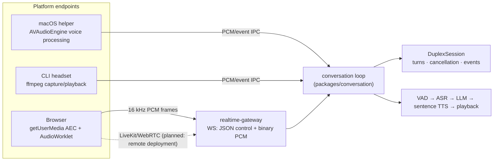
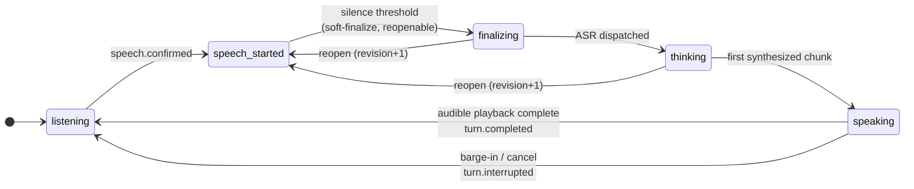

# Duplex audio architecture

Status: Accepted, 2026-07-12; a living architecture document since. Delivered so far:
the session kernel, the shared conversation loop, the realtime gateway and Web Studio
realtime, the OpenAI Realtime dialect ([openai-realtime-adapter.md](./openai-realtime-adapter.md)),
and the first-chunk clause fast path (§Turn timing). LiveKit remote transport stays
planned.

## Scope

VoxStudio needs one conversational-audio design that serves the local `vox`
CLI first and a browser client later. The product must support a user speaking
while synthesized speech is playing, allow a deliberate interruption to stop
the active reply, and avoid treating the product's own playback as user speech.

This document covers real-time capture, playback, acoustic echo cancellation
(AEC), turn control, and transport. It does not change the existing engine
contract for batch ASR, LLM, or TTS requests.

## Decisions

1. Duplex conversation is a shared TypeScript workflow, not a CLI or Web UI
   feature. Platform code owns audio devices and transport; the workflow owns
   turns, cancellation, VAD policy, engine calls, and observable events.
2. AEC is performed at the endpoint that owns both microphone capture and
   speaker rendering. It must not be attempted in a remote engine service.
3. The macOS CLI uses a native audio helper for speaker-mode duplex. The helper
   owns both I/O nodes in one `AVAudioEngine` with voice processing enabled.
   `ffmpeg` plus `ffplay` remains suitable for recording or headset playback,
   but is not an AEC implementation.
4. The browser uses `getUserMedia` echo cancellation and a WebRTC transport.
   LiveKit is the preferred WebRTC room and media adapter, not a dependency of
   the session workflow or model-engine contract. Requested browser constraints
   are verified from the acquired track's settings; they are not treated as a
   guarantee.
5. Every audio, transcript, generation, and playback event carries a session
   and turn identifier. A newer valid user turn cancels all work and buffered
   playback for the previous turn.
6. Turn detection and interruption are policy plug-ins. Manual push-to-talk,
   VAD endpointing, semantic end-of-turn detection, and adaptive interruption
   share the same session state and cancellation contract.

## Non-goals

- Claiming that a cloned voice identifies a person.
- Recording audio or transcripts by default after a session ends.
- Treating VAD alone as proof that a user intended to interrupt.
- Replacing existing one-shot commands such as `vox reply`, `vox say`, or
  batch transcription.
- Requiring LiveKit for local CLI conversations.

## Architecture



The browser lane above is the implemented one (the WebSocket gateway of the
realtime section below); LiveKit remains the planned transport for remote
deployment per decision 4.

`DuplexSession` is platform-neutral code. It consumes clean, timestamped input
PCM frames and emits output PCM frames plus state events. It has no Bun,
browser, LiveKit, Swift, filesystem, or subprocess import. Platform adapters
must provide the following capabilities:

```ts
interface DuplexAudioEndpoint {
  input: AsyncIterable<InputAudioFrame>;       // AEC-cleaned microphone PCM
  play(audio: AsyncIterable<OutputAudioFrame>): PlaybackHandle;
  events: AsyncIterable<AudioEndpointEvent>;   // device, permission, route
  close(): Promise<void>;
}

interface PlaybackHandle {
  done: Promise<void>;
  stop(reason: "barge_in" | "cancel" | "shutdown"): Promise<void>;
}
```

Frames include a monotonic capture/render timestamp, sample rate, channel
count, and `sessionId`/`turnId` where applicable. Platform adapters must bound
their audio buffering (the gateway drops buffered input oldest-first past a
ceiling, so the VAD sees a gap); silently accumulating audio is forbidden.

The initial codec inside a local endpoint is PCM16 mono at 16 kHz for ASR and
PCM16 or float PCM at the TTS sample rate for playback. Resampling happens at
the endpoint boundary. WebRTC/LiveKit may use Opus on the network but does not
change the core frame contract.

## Acoustic echo cancellation

AEC needs two synchronized signals:

```text
render reference = the exact PCM submitted to the local output device
capture signal   = microphone PCM = user + speaker leakage + room reflection
```

The endpoint applies an adaptive filter to the capture signal using the render
reference. It then applies residual echo suppression, noise suppression, and
automatic gain control before emitting input frames to `DuplexSession`. The
render reference must be taken before hardware output, not reconstructed from
the received TTS request. Device latency and route changes are part of the
audio endpoint's responsibility.

### macOS CLI endpoint

The first speaker-mode implementation is a small Swift executable under a
future `platforms/macos-audio/` directory. It uses one `AVAudioEngine` for
`AVAudioInputNode`, `AVAudioPlayerNode`, and `AVAudioOutputNode`, enables voice
processing before starting the engine, and exposes a versioned local IPC
protocol to the Bun CLI. It is available only on supported macOS versions and
reports an explicit capability error otherwise.

The helper is deliberately narrow:

- accepts output PCM and renders it through the same engine;
- returns AEC-processed capture PCM and route/device events;
- supports `start`, `stopPlayback`, `setDevice`, `mute`, `health`, and
  `shutdown`;
- never calls ASR, LLM, TTS, stores transcripts, or handles credentials.

Voice processing is configured before the engine starts. A device or route
change that requires reconfiguration moves the endpoint through an explicit
`reconfiguring` state: stop playback/capture safely, rebuild the graph, verify
voice processing, then resume listening. It must not try to toggle voice
processing on a running engine.

For the first CLI release, a wired or USB headset is the supported duplex
baseline. Speaker mode is enabled only after the native helper passes the AEC
test suite. Bluetooth routes are supported as best effort because profile
switching can alter sample rate, latency, and microphone quality.

Until speaker-mode AEC is available, `vox listen` defaults to half-duplex
playback: it suppresses microphone frames while agent speech is playing and for
a short post-playback guard interval. `--barge-in` is an explicit headphone/
headset-only opt-in; it is never silently enabled for an external-speaker route.

### Browser endpoint

The Web app requests microphone access with `echoCancellation`,
`noiseSuppression`, and `autoGainControl` enabled. It publishes the microphone
track and renders agent audio through the browser's WebRTC audio path. The
browser and operating system retain control over the exact AEC implementation;
the UI exposes the selected device, active route, and a headset recommendation
when AEC capabilities are unavailable.

After capture starts, the browser reads `MediaStreamTrack.getSettings()` and
records the negotiated AEC/NS/AGC state as an endpoint capability snapshot. A
browser may accept a constraint without providing the desired quality on a
particular route. When AEC is unavailable or fails the route-specific smoke
test, speaker-mode auto-barge-in is disabled and the user can use a headset,
push-to-talk, or explicit stop control. Browser audio requires HTTPS; microphone
permission denial is a first-class recoverable state, not a generic failure.

The browser must not bypass this route by independently capturing with
`MediaRecorder` while playing the agent through an unrelated element. That
breaks the browser's ability to associate capture and render paths. Raw PCM is
processed in an `AudioWorklet` only when a measured requirement cannot be met
by the standard WebRTC path.

### Transport choice

The browser uses LiveKit for authenticated WebRTC media rooms when it connects
to a remote product service. LiveKit carries continuous microphone and agent
audio tracks, plus data messages for state and captions. A LiveKit agent/gateway
adapts tracks to `DuplexSession`; it does not contain turn policy.

The local CLI bypasses LiveKit and connects to `DuplexSession` through local
IPC. This keeps the CLI usable without a room server and makes local-device AEC
testable independently from network conditions.

## Turn state and cancellation



(The same state machine the technical report's figure 2 maintains — one canonical
diagram. The earlier sketch omitted the reopen transitions, which are the default
policy now.)

While `speaking`, capture continues. The initial policy requires post-AEC VAD
speech for a configurable minimum duration and level. The threshold is
calibrated by test data; it is not a fixed product constant. It is deliberately
replaceable by a semantic end-of-turn detector or an adaptive interruption
model, which can distinguish a real interruption from short acknowledgements.
On confirmation:

1. mark the active turn `interrupted`;
2. abort streaming ASR/LLM/TTS requests with an `AbortSignal`;
3. invoke `PlaybackHandle.stop()` to discard local output immediately;
4. keep capture frames and begin the new user turn without reopening the
   microphone;
5. ignore late audio, text, or completion events whose turn ID is no longer
   current.

The user can also explicitly mute, stop, or switch back to push-to-talk. These
controls are distinct from VAD and always take precedence.

An interruption is provisional until a policy confirms it. If a VAD-only
interruption later has no usable speech, the session records `false_barge_in`.
The initial CLI does not resume partially played audio because that can be more
confusing than restarting the reply; it offers an explicit replay action. A
future endpoint may resume only from a recorded, timestamped playback
checkpoint after usability tests demonstrate that behavior is preferable.

### End-of-turn commitment and speculative reopening

Waiting for a long silence before finalizing a turn charges that wait to every
reply's latency. The speculative policy ends a turn early and undoes the call
when it was wrong, instead of paying up front for certainty:

- A turn **soft-ends** after a short silence (target ~150 ms) and dispatches
  ASR and the reply speculatively. The long conservative silence (650 ms)
  remains the fallback policy and the hard upper bound.
- The **commitment point** is the first synthesized audio reaching playback.
  Until then the turn is reopenable: resumed user speech within a short window
  (~1 s) — or a longer window (~7 s) when no assistant audio has started —
  **reopens** the same turn rather than starting a new one.
- Reopening keeps the turn id and increments a **revision**. All in-flight
  work for prior revisions is aborted, and results are rejected by
  `(turnId, revision)`, exactly as stale-turn work is rejected today.
- Confirmation for speech that continues a reopenable turn uses a lower
  threshold than fresh speech (about half the fresh `minSpeechMs`): continuing
  an open turn is more plausible than starting one, and the hysteresis avoids
  chopping a hesitating speaker into fragments.
- Reopening never happens while the session is `speaking`. Interrupting
  playback is the barge-in path, whose confirmation policy is certified by the
  AEC gate and is not altered by this policy.

The policy cannot become the default on feel. Required before the flip:
measured end-to-end reply latency delta (from the timing events below), the
false-reopen rate (a new topic wrongly merged into the previous turn), and the
wasted-speculation rate (ASR/LLM work discarded by reopens).

First measured 2026-07-14 against the remote engines: the mechanism worked but
the 500 ms saving was unresolvable under the then-8.5 s pipeline's variance, so
the default stayed conservative and the streaming adapters were built first.
Re-measured the same day on the fully local stack (reply latency p50 2.1 s):
stop-to-reply p50 fell to 1.67 s (−455 ms), zero false reopens under deliberate
topic-switch testing, and 18 reopens across 14 turns of wasted speculative
dispatch — local compute, inaudible. The gate passed and speculative is now the
default; `--turn-taking conservative` remains available.

### Turn timing

Every turn emits one `turn.timing` event when it completes or is interrupted,
carrying millisecond offsets from the start of user speech for the points the
turn actually reached: `vad_end`, `thinking`, `asr_done`, `speaking`,
`tts_first_audio`, `playback_first`, plus the end reason. State transitions
stamp their own points; engine milestones are marked explicitly by the loop
that awaits them. The event is in-memory session telemetry; surfacing it is
opt-in per the privacy rules below.

### Streaming ASR (measured 2026-07-19, retired)

The "streaming ASR upgrade" this document deferred (`transcript.partial`) is
retired on two independent measurements pointing the same way:

1. **Engine-side** (technical report, 2026-07): MPS acceleration took a single
   SenseVoice utterance from 475 ms to 26 ms — batch inference stopped being
   the thing streaming would have hidden.
2. **End-to-end** (2026-07-19, five live-replay turns against the local stack,
   `turn.timing` offsets): the full ASR leg — WAV assembly, HTTP, wrapper,
   inference — costs **100–134 ms**, ~8% of the ~1.2–2.1 s from end of speech
   to first reply audio. The dominant segment is `llm_first → speaking` at
   **~700–1070 ms (60–70%)**: the reply pipeline waits for the model
   (~59 chars/s) to finish the first *sentence* before synthesis may start.

A real streaming ASR would mean an engine swap (SenseVoice is an offline AED
model; streaming means paraformer-online/zipformer), a partial-transcript
protocol, and reworking keyterm correction over unstable prefixes — all to
attack the smallest slice of the budget, bounded at ~100 ms. The
`transcript.partial` event name stays reserved in the wire format, but nothing
plans to send it. What the same measurement points at instead: a first-chunk
clause boundary in the reply pipeline (the first synthesizable piece may end
at clause punctuation instead of a sentence ender), and the MTP source build
(59 → ~200 chars/s generation) as the deeper lever.

### First-chunk clause fast path (built 2026-07-19)

The successor named above, delivered the same day: before anything has been
synthesized, once the reply's un-terminated text speaks for
`chunking.first_clause_seconds` (config knob; the conversation loop defaults
it to 1.2 s), the first chunk may end at clause punctuation — the existing
`clauseBreaks` set, digit-guarded for ASCII separators, closing quotes riding
along. Every later chunk keeps the sentence rule, so exactly one seam can fall
mid-sentence, cushioned by the same `join_pause_ms` every seam gets. Long-form
reading (`vox say`) is seam-bound, not latency-bound, and stays sentence-only
unless configured.

Measured (2026-07-19, interleaved A/B against old and new gateways, same
long-answer question): `llm_first → speaking` fell from 1057–1124 ms to
**638–659 ms (−40%)**, taking end-of-speech → first audio to **~1.0 s**; on a
short-first-sentence reply the path never triggers and the numbers are
unchanged — the fast path caps the wait exactly when the first sentence is
long, which is when it hurt. The ear test (2026-07-19, live Web Studio
conversation): the seam was judged not noticeable.

## VAD policy

`EnergyVadSegmenter` is the tested fallback used by the first headset CLI loop.
It exists for diagnostics, deterministic fixtures, and operation where a model
artifact cannot be loaded; it is not the production-default quality target.

**The default's advantage, quantified** (`bun run measure:vad`, promoted from the
2026-07-22 A/B probe): through the product segmentation path at default options,
the two detectors have *identical* sensitivity (the shared 0.01 RMS level floor —
silero's echo pre-gate — makes silero's trigger set a subset of energy's, so both
hit every audible positive and both miss below the floor by design) and
equivalent confirm latency (medians within ~15 ms either way across runs). The
difference is specificity: over deterministic non-speech negatives above the
floor — keyboard-like click trains, fan-level broadband noise, appliance hum —
the energy detector confirms "speech" at **3–4/min** while silero confirms
**zero**. A confirmed false barge-in kills the playing reply, so this is the
user-facing meaning of "silero is better": typing next to the microphone
interrupts an energy-detector conversation and does not interrupt a silero one.
The gate fails if silero ever misses an audible positive, confirms a negative,
confirms below the floor (the floor moving must be a decision, not drift), or
falls more than 50 ms behind energy's confirm latency; the zero-false-confirm
contrast is also a standing regression test in `platforms/bun/src/silero.test.ts`.

The production VAD target is the 16 kHz ONNX Silero VAD model. It is chosen for
low CPU latency, multilingual use, permissive licensing, and deployment through
native ONNX Runtime or ONNX Runtime Web. The model artifact is fetched into a
verified local cache rather than committed to this repository. A VAD adapter
must expose the same frame/segment contract as `EnergyVadSegmenter`, so the CLI
and Web do not take a dependency on a particular detector.

`SileroVadSegmenter` implements that adapter. The segment lifecycle — pre-roll,
provisional `speech.start`, confirmation, `speech.dropped`, ends — lives in one
shared `VadSegmentAssembler`, so both detectors carry the exact barge-in
semantics the AEC gate certified; Silero replaces only the per-window voiced
judgement (model probability with start/end hysteresis, 0.5/0.35 defaults).

A speech model alone is not sufficient for speaker-mode duplex, and this is
measured, not speculative: residual echo after cancellation is quiet speech —
the agent's own leaked voice — and rescoring the certified AEC-gate captures
showed Silero confirming self-interruptions on residual the energy detector
never noticed (3.8/min against 0). `SileroVadSegmenter` therefore applies a
level pre-gate (`minLevel`, default aligned with the energy threshold at 0.01
RMS): windows below it are unvoiced without consulting the model, which also
skips inference on silence. With the gate, the same captures score 0 confirmed
self-interruptions and 12/12 operator barge-ins with none false. A live gate
run on 2026-07-14 (same route, real TTS far-end, 12 operator cues) certified
the gated detector: 0 confirmed self-interruptions (5.6/min raw model starts
absorbed), 12/12 barge-ins heard with none missed or false, and detection
latency p50 574 ms — 69 ms faster than the energy detector's certified run.
Silero is therefore the default everywhere (2026-07-22): the native ONNX
runtime in the workspace, an embedded onnxruntime-web WASM backend inside the
compiled binary (same model, outputs identical to 2.4e-7, 0.2 ms per window;
one process-shared inference session serves every stream), with release
builds embedding the SHA-verified model itself so the standalone binary needs
no first-use network. `listen` degrades loudly to the equally-certified
energy detector only if both runtimes fail, and `--vad` selects one
explicitly. The model is pinned by version and SHA-256 (Silero VAD v5.1.2,
MIT) and fetched into `~/.cache/voxstudio/` on first use where not embedded;
a hash mismatch refuses to load.

## Realtime gateway and events

Existing OpenAI-compatible engine endpoints remain valid for one-shot work.
The product adds a realtime gateway above them rather than adding WebRTC
semantics to each engine:

```text
apps/realtime-gateway
  -> packages/conversation (the shared loop `vox listen` also runs)
  -> packages/duplex-session
  -> packages/clients (ASR, LLM, TTS adapters)
```

The gateway (implemented 2026-07-15, protocol v1) exposes the versioned session
event schema over a WebSocket at `/v1/realtime`. Media is carried as binary PCM
frames, not base64 JSON: client frames are raw mono float32 at 16kHz —
timestamps are stamped server-side from the sample count, keeping client clocks
out of the protocol — and server frames are reply audio at the rate announced
by the preceding `playback.format` event. Every control message has a monotonic
`sequence`, `sessionId`, and schema version. On reconnect (the session outlives
its socket by a grace period), a client reattaches, resynchronizes from the
pushed `session.snapshot`, and must not replay stale commands; the gateway
enforces this rather than trusting it — every command carries an idempotency
key (replays are acknowledged as `command.duplicate`, never re-executed), and a
`turn.interrupt` naming a superseded turn is rejected as stale.

### Wire format

Two frame types share the one socket; media is never base64-wrapped in JSON:

```text
text frame    JSON control message (commands up, events down)
binary frame  raw mono float32 PCM
                up:   microphone samples @ 16 kHz (server stamps timestamps)
                down: reply audio @ the rate the last playback.format announced
```

**Client → server — commands.** Every command carries the protocol version `v`
and a non-empty `idempotencyKey`; a replay is answered `command.duplicate` and
never re-run. Envelope and the six types:

```text
{ "v": 1, "type": "...", "idempotencyKey": "...", ...typeFields }

session.start            { options?: SessionStartOptions }
session.attach           { sessionId }        # reconnect to a live session
session.snapshot.request { }                  # ask for a fresh session.snapshot
turn.interrupt           { turnId }           # stale turnId -> command.rejected
playback.complete        { turnId }           # audible-clock ack (playbackAck)
session.stop             { }
```

`SessionStartOptions` (all optional): `language`, `system`, `maxTokens`,
`voice`, `bargeIn`, `turnTaking` (`conservative`|`speculative`), `reopenMs`,
`vad` (`energy`|`silero`), `threshold`, `silenceMs`, `minSpeechMs`,
`playbackAck`, the etiquette options `welcome` and `nudgeAfterSeconds`
([conversation-etiquette.md](./conversation-etiquette.md)), and the
engine-instance overrides `asrEngine`/`llmEngine`/
`ttsEngine` (unset = the configured role default; an unknown name is a
`400`/rejection, never a silent fallback). An unknown command type, wrong `v`,
or missing `idempotencyKey` is rejected without touching session state.

**Server → client — events.** Every event carries `v`, a monotonic `sequence`,
`sessionId`, and `timestampMs`. Types (v1 implements all but the annotated ones):

```text
session.state       { state, previous }
vad.end             { turnId }
transcript.final    { turnId, revision, text }
response.text.delta|final { turnId, revision, text }
playback.format     { turnId, revision, sampleRate }
playback.ended|interrupted { turnId }
turn.started|interrupted|completed|false_barge_in|reopened { turnId, ... }
turn.timing         { turnId, endReason, offsetsMs: { vad_end, thinking,
                       asr_done, llm_first, speaking, tts_first_audio, playback_first } }
tool.call           { turnId, name, arguments }       # tool loop (tool-loop.md)
tool.result         { turnId, name, ok, result? }
tool.pending        { turnId, name, arguments }       # awaiting spoken confirmation (mcp-tools.md)
session.snapshot    { state, currentTurnId?, lastSequence }
session.notice      { message }
command.accepted|duplicate|rejected { commandType, idempotencyKey, reason? }
error               { code, message, recoverable, turnId? }
audio.level         { rmsDb, clipped, source }        # deferred to the browser endpoint
transcript.partial  { turnId, text }                  # reserved; streaming ASR retired (see Turn timing)
endpoint.capability { aec, ns, agc, route, sampleRate } # deferred to the browser endpoint
```

Alongside the socket, a REST facade forwards one-shot work over ordinary
OpenAI-compatible HTTP, so the same gateway serves batch and management calls
without WebRTC semantics:

```text
GET  /v1/realtime            WebSocket upgrade (426 without it) — the protocol above
POST /v1/audio/speech        TTS   (OpenAI-compatible)
POST /v1/audio/transcriptions ASR  (multipart audio)
POST /v1/chat/completions    LLM   (JSON, SSE when streamed)
GET|POST|DELETE /v1/voices   /v1/voices/{id}  — multi-engine voice bank (aggregated)
POST /v1/design-profiles     design-profile voices
GET  /v1/engines             engine registry with live health + runtime
GET  /healthz                liveness probe
```

The facade injects engine credentials server-side and routes by role/capability
across the registry, so engine addresses and keys never reach a browser. The
gateway binds loopback by default and takes an optional bearer token — required
on every request and the WebSocket upgrade (browsers that cannot set headers may
pass it on the query string); exposure is a deployment decision (a tunnel,
Access at the door). The endpoint owns the audible-playback clock: with the
`playbackAck` session option, the turn stays `speaking` after the last piece
is sent until the client's `playback.complete` command for that turn (capped
by the audio's own duration plus slack, so a silent client cannot wedge the
session) — the same lesson the CLI's playback-clock fix taught, expressed as
protocol. Events emitted while no socket is attached are dropped by design,
the snapshot being the resync mechanism. Bounded input buffering (30s,
oldest-first drop) means the gateway never retains an unbounded live
recording while an engine stalls.

### OpenAI Realtime compatibility (evaluated 2026-07-16; built 2026-07-19)

> **Update 2026-07-19 — the subset adapter shipped.** Design, event mapping, and
> the SDK-as-client gate live in
> [openai-realtime-adapter.md](./openai-realtime-adapter.md); the evaluation and
> tiering below are the record of how it was scoped. The adapter shares
> `/v1/realtime` with the native protocol via dialect detection at upgrade, and
> client-declared function tools ride the conversation tool loop.

Our `/v1/realtime` shares a path with `api.openai.com/v1/realtime` and nothing
else: the wire formats are unrelated, and an OpenAI Realtime client cannot
connect. The differences are deliberate, not accidental — raw binary PCM
instead of base64-in-JSON, three swappable engine stages instead of one
speech-to-speech model, and reconnect/idempotency/audible-clock semantics the
OpenAI protocol has no equivalent for. The REST facade above is where this
gateway's OpenAI compatibility lives.

A compatibility adapter was evaluated and split into three tiers:

- **Subset adapter** (~2–3 days): a separate WS route translating the
  audio-only, `server_vad`-only conversation flow — event renames, base64
  PCM16@24kHz transcoding, a `session.update` subset. Reuses `GatewaySession`
  unchanged; lets OpenAI SDKs and off-the-shelf voice UIs connect for plain
  conversation.
- **Tool calling and text items** (1–2 weeks): requires a tool loop and
  history-injection in `packages/conversation`. That is a product feature that
  would also serve the CLI and Web Studio; if wanted, it is built as one, not
  as adapter fidelity.
- **WebRTC + ephemeral tokens**: no WebRTC stack exists for Bun; the browser
  remote path is already planned through LiveKit. Out of scope for an adapter.

Deferred because the costs are real — the base64/24kHz hot path this protocol
deliberately avoided, our differentiators degraded to the narrower OpenAI
semantics, and a compatibility treadmill against a still-evolving API (event
names already changed between beta and GA) — while clients that orchestrate
their own pipeline are served by the REST facade today. **Trigger**: a concrete
client hardwired to the OpenAI Realtime protocol that we want to support. The
subset adapter is then built against that client's actual event usage, with the
client as the acceptance test.

**Update 2026-07-17 — priority raised.** A survey of xAI's Voice Agents
(see [competitive-voice-agents.md](./competitive-voice-agents.md)) found its
realtime API speaking the OpenAI Realtime wire shape verbatim —
`conversation.item.create`, `response.create`,
`response.output_audio.delta` with base64 audio — at
`wss://api.x.ai/v1/realtime`. The protocol is consolidating into a de-facto
standard across vendors, which changes the adapter's value from "support one
client" to "join an ecosystem": one subset adapter would let clients and
tooling written for OpenAI or xAI realtime endpoints point at this gateway.
The decision stays a subset adapter (WS-only, `server_vad`-only, audio-only;
tools remain a product feature, WebRTC stays out of scope), but it is now
roadmap work rather than trigger-gated; a concrete client remains the
acceptance test when it lands.

## Provider requirements

Realtime-capable client methods accept an `AbortSignal`, an optional turn ID,
and emit timing information. The existing `LlmClient.chat()` and
`TtsClient.speech()` are retained for batch commands; new streaming methods are
additive:

```ts
transcribeStream(frames, options, signal): AsyncIterable<TranscriptEvent>
chatStream(messages, options, signal): AsyncIterable<TextDelta>
speakStream(text, options, signal): AsyncIterable<PcmAudio>
```

Sentence segmentation bridges an LLM text stream to TTS. It sends complete
sentences early but preserves unfinished text until a valid boundary or flush.
Playback applies backpressure through the player write path — the CLI's player
pipe and the gateway's endpoint-owned audible clock (`playbackAck`) — rather
than generating unbounded audio.

## Privacy and safety

- Microphone permission is requested by the endpoint and visibly represented
  in CLI/Web state.
- Raw microphone audio is in memory only by default. Saving a recording is an
  explicit command or UI action with a path/retention choice.
- Transcripts, timing telemetry, and debug PCM are opt-in. Production logs use
  IDs and aggregate counters, not transcript text or raw audio.
- Web session tokens are short-lived and scoped to one room/session. Engine
  credentials never reach the browser.
- WebRTC media and control traffic use TLS/DTLS/SRTP. End-to-end encryption is
  an explicit deployment mode: a server-side agent can process E2EE media only
  when it is admitted as a participant with the required key. It is not claimed
  merely because the LiveKit transport supports E2EE.
- Voice registration keeps consent/provenance as a separate future workflow;
  duplex audio does not loosen that requirement.

## Quality gates

The feature is not accepted based on subjective demos alone. The test corpus
contains replayed agent speech, near-end user speech, double-talk, quiet rooms,
speaker routes, wired headsets, Bluetooth routes, and device changes.

Required measurements per supported endpoint:

- false barge-in rate during agent-only playback;
- missed barge-in rate during overlapping near-end speech;
- echo return loss enhancement (ERLE) and near-end speech distortion;
- capture-to-local-mute latency after a confirmed barge-in;
- VAD end to ASR final, first LLM token, first TTS audio, and audible first
  playback latency (p50/p95);
- device-route change, permission-denied, and cancellation recovery tests.
- negotiated AEC/NS/AGC capability coverage by browser, operating system, and
  audio route, with the chosen fallback recorded.

The first release target is deterministic cancellation and no self-interruption
with a wired headset. Speaker-mode AEC requires a separate empirical gate on
supported macOS hardware. Browser and CLI metrics are reported separately.

## Delivery phases

1. **Session contract and test harness**: `packages/duplex-session` now owns
   strict turn transitions, per-turn `AbortSignal`, and sequence-numbered
   events, with focused unit tests. The reconnect and
   idempotency transport tests now run against the realtime gateway (2026-07-15):
   simulated duplex turns over a real WebSocket, snapshot resync after a
   dropped socket, duplicate-command acknowledgement, and stale-interrupt
   rejection. The conversation loop itself moved to `packages/conversation`,
   shared verbatim by `vox listen` and the gateway, so the certified lifecycle
   has one implementation.
2. **CLI headset duplex**: `vox listen` now uses continuous FFmpeg PCM capture,
   fallback VAD segmentation, cancellation, bounded playback, and explicit
   headset mode. It has simulated end-to-end coverage, and `--vad silero`
   selects the Silero ONNX adapter (see VAD policy). Real-device headset
   validation and a Silero gate run remain before declaring it supported.
3. **Streaming adapters**: batch ASR, LLM, and TTS clients accept the current
   turn's `AbortSignal`, and `streamLong` stops requesting chunks after
   cancellation. `LlmClient.chatStream` streams completions over SSE — an
   engine that answers with plain JSON degrades to one full-reply delta — and
   `streamReply` pipelines the token stream into synthesis: the first complete
   sentence is synthesized immediately while the model keeps generating, later
   sentences accumulate into growing chunks, and one continuation session spans
   the reply. `vox listen` speaks through this pipeline. Streaming ASR was
   retired on measurement (see Turn timing); engine-side TTS audio streaming
   (the ~2.5s fixed per-request synthesis overhead) remains.
4. **macOS audio helper**: `platforms/macos-audio/vox-audio-host.swift` now
   builds a narrow stdin/stdout PCM helper using `AVAudioEngine` Voice
   Processing; `vox listen --speaker-duplex` selects it. The empirical gate
   (`bun run measure:aec`) measures voice-processing attenuation, confirmed
   self-interruption rate, capture-to-mute latency, and missed barge-ins on
   real hardware, and refuses to pass an incomplete or synthetic-stimulus run.
   Interruption is now provisional as specified above: `listen` stops playback
   on `speech.confirmed` (minSpeechMs of voiced audio), and an unconfirmed
   trigger is recorded as `false_barge_in` while playback continues. The gate
   passed on 2026-07-13 on built-in MacBook Pro speakers/microphone with real
   TTS far-end speech: 0 confirmed self-interruptions (13.2/min raw triggers
   absorbed by confirmation), 12/12 operator barge-ins heard with none missed
   or false, capture-to-mute p95 186ms, 26.5dB direct path attenuation. Route
   changes, capability reporting, and release packaging remain required
   before speaker duplex is declared supported.
5. **Web Studio realtime**: `apps/realtime-gateway` now speaks the session
   protocol above (WebSocket control, binary PCM media, snapshot reconnect,
   idempotent commands) and the REST facade, driving the shared conversation
   loop — Web Studio Phase 1 in [web-studio.md](./web-studio.md). The browser
   endpoint (getUserMedia AEC negotiation, `endpoint.capability`, the
   audible-playback clock) is Web Studio Phase 2 and keeps the measured-gate
   discipline.
6. **Cross-platform endpoints**: evaluate native platform voice-processing APIs
   or standalone WebRTC APM for Windows/Linux only after the macOS and browser
   measurements demonstrate a concrete gap.

No phase creates empty Web, desktop, or native directories. Each is introduced
with its first tested owned module.

## References

- Apple, [AVAudioIONode voice processing](https://developer.apple.com/documentation/avfaudio/avaudioionode): macOS input and output nodes expose voice-processing controls.
- Apple, [What's new in voice processing](https://developer.apple.com/videos/play/wwdc2023/10235/): macOS 14 availability, AEC/NS/AGC behavior, and `AVAudioEngine` versus `AUVoiceIO` options.
- WebRTC, [Audio Processing Module](https://webrtc.googlesource.com/src/%2B/refs/heads/main/modules/audio_processing/g3doc/audio_processing_module.md): capture and reverse-render streams for AEC, NS, and AGC.
- LiveKit, [Realtime media and data](https://docs.livekit.io/frontends/build/media-data/): WebRTC media tracks and data/state channels for agent clients.
- W3C, [Media Capture and Streams](https://www.w3.org/TR/mediacapture-streams/): browser AEC constraint semantics and route-dependent negotiated settings.
- LiveKit, [Turns overview](https://docs.livekit.io/agents/logic/turns/): turn detection, interruption, false-interruption recovery, and manual control patterns.
