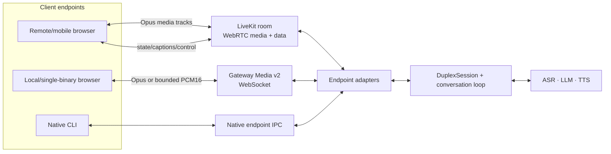

# Realtime media transport

Status: Accepted implementation plan, 2026-08-04. Research, current-state
measurement, Phase 0 observability, and Phase 1 legacy PCM hardening are delivered.
The Phase 1 iPhone/Tailnet device gate passed on 2026-08-04. The Phase 2 PCM16 slice is
implemented behind explicit negotiation, including its continuous AudioWorklet
renderer. Studio advertises it only after worklet initialization succeeds. The bounded
long-run metrics and strict Phase 2 report generator are implemented; the actual device
and shaped-network runs are still required before the slice is considered delivered.
The Phase 3A bootstrap, server media adapter, and browser client are implemented. An
authenticated, same-origin-guarded boundary resolves an owner-scoped Agent, claims the
room with an isolated rtc-node programmatic participant, and only then mints a unique
five-minute browser grant. The adapter maps the expected microphone participant, PCM,
control data, interruption, playout draining, and room lifecycle to the existing
`GatewaySession`. When `/healthz` advertises `deployment.livekit: true`, Agent Builder's
Try it live publishes one processed microphone track, subscribes to the Agent track, and
uses reliable data messages for protocol-v1 events and controls. Deployments without the
complete signer/adapter capability keep the existing WebSocket path. A real LiveKit
deployment/device gate and WebRTC statistics are still required before Phase 3A is
considered delivered.

This document turns the remote/mobile audio investigation into an implementation
contract. It refines the transport portion of
[duplex-audio-architecture.md](./duplex-audio-architecture.md); that document remains
authoritative for endpoint ownership, AEC, turns, cancellation, and playback
acknowledgement. This document owns wire codecs, packetization, browser rendering,
network backpressure, media telemetry, and the migration from the current browser
WebSocket path to WebRTC/LiveKit. Hosting/vendor selection, dated pricing, and
deployment economics live in
[the dated provider evaluation](../research/reports/2026-08-04-realtime-media-provider-evaluation.md).

## Executive decision

VoxStudio adopts two realtime media paths behind the same `DuplexAudioEndpoint` and
conversation-session contracts:

1. **Remote browsers and mobile clients use WebRTC through LiveKit.** Microphone and
   Agent audio travel as media tracks; session state, captions, tools, and control
   events travel as data messages. This is the production remote path.
2. **Local and single-binary deployments retain a WebSocket path, upgraded to Media
   Protocol v2.** It negotiates Opus first, bounded PCM16 as a compatibility fallback,
   and float PCM only for loopback/debugging. It never accumulates unbounded audio.
3. **The current float32-PCM WebSocket path is legacy compatibility, not the remote
   architecture.** Before Media v2 lands, it receives only a bounded-chunk and
   backpressure hardening pass.

“LiveKit” here names the initial room/media adapter contract, not a permanent mandate
to buy LiveKit Cloud. The first device gate uses LiveKit Cloud Build; private
deployments use self-hosted LiveKit; alternatives must pass the same endpoint contract
before replacing either. The dated provider decision and cost model are recorded in
[the provider evaluation](../research/reports/2026-08-04-realtime-media-provider-evaluation.md).

Increasing the fixed playback cushion is not the solution. It can conceal one network
profile by adding conversational delay, but it does not reduce bandwidth, TCP
head-of-line blocking, stale playback after interruption, or unbounded sender queues.

## Scope

This document covers:

- browser microphone and Agent-audio transport;
- wire codec selection and packet duration;
- client decoding and continuous playback;
- jitter-buffer and sender-backpressure policy;
- interruption and revision semantics at the media boundary;
- observability and real-device/network acceptance gates;
- migration that preserves local `vox studio` operation.

It does not change ASR, LLM, TTS, VAD, turn-taking, voice registration, retained-media
policy, or the OpenAI Realtime dialect. It does not require LiveKit for the macOS CLI
or a loopback Studio session.

## Current state and evidence

### Browser wire path

The delivered native VoxStudio WebSocket dialect uses JSON text frames for events and
commands and unframed binary float32 PCM for media:

| Direction | Current payload | Rate | Sustained payload rate |
|---|---|---:|---:|
| Browser microphone to gateway | mono f32 PCM | 16 kHz | 64,000 B/s (512 kbps) |
| Gateway TTS to browser | mono f32 PCM | commonly 48 kHz | 192,000 B/s (1.536 Mbps) |
| Full duplex, excluding framing | f32 PCM | mixed | 256,000 B/s (2.048 Mbps) |

The microphone is already framed at 320 samples, or 20 ms at 16 kHz. TTS pieces are
handed to the socket in the sizes produced downstream, without media sequence numbers,
timestamps, a stream identity, or sender backpressure. The browser receives a complete
WebSocket binary message, turns it into a `Float32Array`, and creates one
`AudioBufferSourceNode` for that message. Playback starts or re-buffers with a fixed
700 ms lead.

The implementation points are
[protocol.ts](../apps/realtime-gateway/src/protocol.ts),
[session.ts](../apps/realtime-gateway/src/session.ts),
[server.ts](../apps/realtime-gateway/src/server.ts), and
[audio.ts](../apps/web/src/lib/audio.ts).

An engine-to-gateway stream may already use Ogg/Opus when the selected TTS engine and
gateway decoder negotiate it. That optimization ends at the gateway: the decoded
audio is still sent from gateway to the native browser client as float32 PCM. Engine
wire compression therefore does not solve the browser downlink.

### 2026-08-04 mobile investigation

The investigation observed all of the following:

- A local VoxCPM2 stream produced 9.12 s of audio in 4.61 s, with first audio at
  882 ms and a maximum observed producer-delivery gap of 744 ms. Inference supplied
  audio at roughly twice realtime overall, so sustained TTS generation was not the
  primary mobile stall.
- A common downstream PCM piece was 184,320 bytes: 960 ms of 48 kHz mono f32 audio.
  Transferring one complete message takes approximately 737 ms at 2 Mbps, 1.47 s at
  1 Mbps, or 2.95 s at 512 kbps, before browser code can schedule it.
- The tested iPhone had recent direct Tailscale UDP endpoint activity. A DERP-only path
  was therefore not required to reproduce the risk; ordinary mobile bandwidth,
  contention, retransmission, and route variation are sufficient.
- The repository's earlier remote-engine incident measured only 30–65 KB/s over a
  private overlay while 48 kHz f32 needed 187.5 KB/s. Opus removed the bandwidth
  deficit; re-buffering and decoded-PCM coalescing then fixed two independent playback
  artifacts. See [technical-report.md §9.5](./technical-report.md#95-case-5-three-layer-degradation-behind-remote-audio-noise-v11).

The diagnosis is consequently:

> Mobile network conditions trigger the symptom, but large uncompressed application
> messages over a reliable ordered WebSocket make the system unnecessarily fragile.

TCP retransmission delays every later byte on the connection. The browser WebSocket
API also delivers the application message as a completed `Blob` or `ArrayBuffer`, not
as independently playable fragments. A near-one-second PCM message can therefore
consume the entire current lead before it becomes schedulable.

### Playback granularity is a separate constraint

Smaller network packets alone are insufficient. The earlier Opus investigation found
that passing decoded 20 ms pieces directly to Web Audio created about 50
`AudioBufferSourceNode`s per second and produced continuous boundary artifacts.
Coalescing decoded PCM to at least 240 ms (260 ms median in that gate) removed the
artifact.

Media should therefore be small on the wire and continuous at the renderer:

- 20 ms codec packets for latency, loss recovery, and network scheduling;
- a ring buffer consumed by the audio render clock, not one source node per packet.

## Architecture



The core session continues to consume and produce timestamped PCM. Codec, transport,
jitter, browser device state, and audible-render completion stay in endpoint adapters.
ASR, TTS, turn policy, and tools never import LiveKit or browser APIs.

## Decisions

### 1. WebRTC/LiveKit is the remote default

WebRTC endpoints are required to implement Opus, and WebRTC supplies the media
facilities that a voice product otherwise has to rebuild: RTP timestamps, adaptive
jitter buffering, congestion response, packet-loss concealment, and standardized
statistics. LiveKit adds authenticated room lifecycle and a server-side media adapter
without moving turn policy out of VoxStudio.

The mapping is:

| VoxStudio concern | LiveKit/WebRTC surface |
|---|---|
| Browser microphone | published WebRTC audio track |
| Agent speech | subscribed WebRTC audio track |
| Captions and turn events | reliable data/text messages |
| Interrupt, mute, session control | small data messages / RPC |
| AEC/NS/AGC | browser capture/render endpoint |
| Network health | `RTCPeerConnection.getStats()` plus application events |

Opus bitrate, packet-loss resilience, and jitter target should be treated as transport
hints, not hard cross-browser guarantees. The initial speech-quality target is mono
Opus around 32–48 kbps; the browser/WebRTC congestion controller remains free to
adapt. In-band FEC belongs here, where later RTP packets can arrive despite an earlier
loss. It provides no head-of-line benefit inside a reliable ordered WebSocket.

Room credentials are short-lived and owner/session scoped. The client may join only
the intended room with the required publish/subscribe permissions. Engine addresses,
service credentials, and long-lived API keys never enter the browser.

### Deployment profiles and billing boundary

| Product/deployment context | Default media path |
|---|---|
| local CLI or loopback Studio | native IPC or WebSocket Media v2; no RTC service |
| remote/mobile development gate | LiveKit Cloud Build |
| private/on-premises deployment | single-node self-hosted LiveKit initially |
| Portal initial production | LiveKit Cloud, after privacy and cost approval |
| high-volume optimization | re-evaluate self-hosting and Cloudflare after measured triggers |

In the managed baseline, VoxStudio runs its Agent adapter and every inference engine
itself. LiveKit Cloud supplies room, WebRTC media/data, SFU/TURN, and transport
statistics only. That consumes WebRTC participant minutes and downstream transfer; it
does not inherently consume LiveKit-hosted Agent sessions, LiveKit Inference,
observability recordings, telephony, or egress. Those products require separate,
deliberate decisions.

Prices and quotas are deliberately excluded here because they change. The current
snapshot, calculation assumptions, provider comparison, and reconsideration triggers
live in the provider evaluation document.

### 2. WebSocket Media v2 is a first-class local fallback

WebSocket v2 exists for the self-contained product shape, deployments that do not run
LiveKit, compatibility clients, and measurement. Its codec preference is:

1. `opus` — mono, 20 ms packets, 48 kHz decode rate, VBR, initial target 48 kbps;
2. `pcm_s16le/24000` — 384 kbps, after a voice-quality gate;
3. `pcm_s16le/48000` — 768 kbps when exact downlink bandwidth permits it;
4. `pcm_f32le` — loopback, diagnostics, and protocol-v1 compatibility only.

The list above describes Agent-audio downlink quality. Microphone uplink also prefers
20 ms mono Opus, at a lower speech bitrate; the gateway decodes and resamples it to the
conversation kernel's canonical 16 kHz ASR frames. Codec clock rate, decoded sample
rate, and core sample rate are represented separately rather than inferred from one
field.

The initial Opus mode uses raw Opus packets inside the VoxStudio binary envelope. It
does not add base64 or an Ogg container per frame. One WebSocket message carries one
20 ms packet or, when measurement shows the syscall/framing overhead matters, at most
40 ms. Longer aggregation requires a new measured gate.

Codec negotiation is double-gated: the gateway advertises only codecs it can produce,
and the client selects only codecs it can decode. Unsupported combinations fail or
fall back explicitly; they never reinterpret compressed bytes as PCM.

### 3. Media v2 has explicit stream identity and time

Control remains JSON protocol v1. `session.start.options.media` advertises supported
media configurations and the gateway confirms one with `media.config`. Omitting the
offer preserves the legacy unframed f32 path; an explicit unsupported offer is rejected
instead of silently changing formats. The first exact configuration implemented is
20 ms mono `pcm_s16le` at 24 kHz. Each Agent rendition begins with a control event
resembling:

```json
{
  "type": "playback.start",
  "turnId": "turn_123",
  "revision": 2,
  "streamId": "media_456",
  "codec": "opus",
  "sampleRate": 48000,
  "channels": 1,
  "packetDurationMs": 20
}
```

Every binary media message has a fixed 56-byte little-endian header followed by the
codec payload. The frozen layout is:

| Offset | Size | Field |
|---:|---:|---|
| 0 | 4 | ASCII magic `VOX2` |
| 4 | 1 | media version, currently `2` |
| 5 | 1 | kind: playback `1`, capture `2` |
| 6 | 1 | codec: PCM16 `1`, Opus `2`, float PCM `3` |
| 7 | 1 | flags: start bit 0, end bit 1, discontinuity bit 2 |
| 8 | 2 | header size, currently `56` |
| 10 | 1 | channel count |
| 11 | 1 | reserved, zero |
| 12 | 4 | sample rate |
| 16 | 4 | monotonically increasing stream sequence |
| 20 | 4 | represented duration in samples per channel |
| 24 | 8 | stream timestamp in samples |
| 32 | 4 | payload byte count |
| 36 | 4 | reserved, zero |
| 40 | 16 | binary UUID stream identity |
| 56 | variable | negotiated codec payload, capped at 1 MiB |

The parser rejects unknown versions, kinds, codecs, flags, nonzero reserved fields,
oversized or truncated payload claims, and PCM lengths inconsistent with the declared
duration. A byte-exact golden vector freezes the layout independently of encoder and
decoder round trips.

`playback.end` means the producer has emitted its final packet. It does not mean audio
was heard. The client emits `playback.complete` only after its render worklet has
consumed the stream through the final sample. Timeout behavior remains derived from
media duration plus bounded slack, as defined by the duplex architecture.

On interruption, retry, or speculative reopen, the new `(turnId, revision, streamId)`
supersedes the old stream. Every layer discards queued frames from the stale stream;
late network frames cannot re-arm playback.

### 4. Each browser path has one continuous renderer

The WebSocket v2 downlink pipeline is:

```text
WebSocket media frame
  -> Worker-hosted codec decoder / AudioData
  -> decoded PCM queue
  -> bounded SharedArrayBuffer ring when available
     or transferable-buffer queue fallback
  -> AudioWorkletProcessor
  -> destination
```

For this path, the worklet owns the render cursor and reports consumed samples,
underruns, buffer depth, discontinuities, and the final rendered sample. Main-thread
timers do not own the audible clock.

WebRTC does not pass its 20 ms packets through this custom decoder. A subscribed Agent
track is attached to one persistent browser media renderer, leaving Opus decoding,
packet-loss concealment, jitter buffering, playout timing, and the capture/render
relationship in the browser's WebRTC implementation. Extracting every WebRTC frame
into JavaScript would discard the main reason for choosing WebRTC and is forbidden
unless a later measured requirement proves it necessary.

For WebSocket Opus, the browser feature-detects WebCodecs with
`AudioDecoder.isConfigSupported()`. A tested WASM libopus decoder is the fallback for
older or incomplete engines; PCM16 is the final interoperability fallback. Browser
brand/version checks are forbidden because engine support can change independently.

Neither path creates one `AudioBufferSourceNode` per 20 ms media packet. Legacy PCM may
keep the current scheduled-source implementation during migration, but WebSocket v2
codecs terminate in the worklet ring buffer and WebRTC remains one continuous native
track.

### 5. Buffering is adaptive and bounded

The current fixed 700 ms lead is replaced in v2 by a target based on observed arrival
jitter and underruns. Initial tuning ranges, to be promoted only by the acceptance
gate, are:

| Condition | Initial target |
|---|---:|
| stable LAN/loopback | 120–200 ms |
| ordinary remote route | 200–350 ms |
| temporary recovery after underrun | increase gradually, capped near 600 ms |

The target rises after lateness or underrun and decays slowly after a stable window.
The renderer favors one explicit re-buffering pause over burst-gap-burst playback. An
interruption always empties the superseded stream immediately, regardless of the
current target.

These values are hypotheses, not product guarantees. The device/network matrix below
decides their final defaults.

### 6. Sender backpressure is measured in media time

Every transport adapter has an asynchronous bounded media writer. For Bun WebSockets:

- inspect the result of every `ServerWebSocket.send()`;
- stop feeding the socket when data is queued under backpressure;
- resume from the socket `drain` callback;
- expose queued bytes **and queued audio milliseconds**;
- cap queued unsent media initially at 1,000 ms;
- abort the rendition with a structured `network_congested` event when the cap cannot
  recover, rather than delivering speech several seconds late.

Control and media have separate application queues. A bounded compressed media queue
keeps control responsive in normal operation; no design claims that two queues can
prioritize bytes already blocked inside one ordered TCP connection. If measurement
still shows control starvation, a separate control channel is evaluated explicitly.

Client microphone submission receives equivalent limits. Old capture frames are not
valuable after their realtime window; on overflow the endpoint records a discontinuity
and applies the gateway's documented oldest-first policy rather than growing memory.

### 7. Observability precedes codec rollout

Every session has opt-in, privacy-bounded media telemetry. It contains metadata and
durations, never audio bytes unless the independent retained-media policy authorizes
them.

Gateway telemetry records:

- codec, rate, channels, encoded bytes, and represented audio duration;
- production, enqueue, socket-submit, and drain timestamps;
- `send()` result, backpressure duration, and high-water marks;
- media sequence gaps or drops introduced locally;
- rendition abort reason and stale-frame discard counts.

Browser telemetry records:

- frame receive, decode, enqueue, and render timestamps;
- decoder errors and fallback choice;
- target/actual buffer depth, underrun count, and underrun duration;
- AudioContext state/rate, output route changes where exposed, and worklet health;
- time to first audible sample and interruption-to-silence latency;
- an application ping/pong RTT for WebSocket, because browser WebSocket exposes no
  transport statistics.

WebRTC additionally records standardized inbound/outbound bitrate, packet loss,
jitter-buffer delay/target/minimum, concealed samples, and concealment events where
the browser exposes them. Missing fields stay missing; they are not reported as zero.

Conversation traces and retained media remain separate. Enabling transport telemetry
does not enable transcript, microphone, or Agent-audio retention; see
[conversation-retention.md](./conversation-retention.md).

## Delivery plan

Phase 0 is the prerequisite for every media change, and Phase 1 is the immediate
compatibility hardening. Phase 2 and Phase 3A are independent branches rather than a
strict sequence: prioritize Phase 3A for remote/mobile product use, and Phase 2 for
single-binary/local transport. Neither branch waits for the other to finish.

### Phase 0 — Observability

Deliver the telemetry above for the existing protocol, including ordinary
`/conversation` sessions. Provide a trace export or debug panel that aligns production,
socket delivery, browser queue depth, and audible rendering on one monotonic timeline.

Gate: a synthetic pause injected independently at TTS production, server send, network
arrival, decode, and rendering is attributed to the correct layer.

Delivered 2026-08-04. Protocol-v1 sessions can opt in with `mediaTelemetry`; the Web
Studio does so for ordinary and Agent-preview conversations. Metadata control events
associate every unchanged PCM binary frame with production/enqueue timing, codec/rate,
duration, bytes, socket result, buffered high-water mark, drain timing, and rendition
outcome. A monotonic application ping/pong brackets server residence at receive and
socket-submit boundaries, then estimates RTT and server/client clock offset. Disconnect
gaps are explicit local drops, and backpressure state is scoped to the socket that created
it rather than leaking across reattach.
The browser adds receive/decode/enqueue timing, target and actual queue depth, underruns,
AudioContext state/rate/output latency, input-route changes, scheduled-render callbacks,
and interruption stop cost to one bounded metadata-only export. Export schema
`voxstudio.media-trace.v2` retains every clock-sync receive sample, projects production,
enqueue, socket, receive, decode, browser-enqueue, and render points onto the client
monotonic clock, and emits a real attribution record for every complete frame. Normal
rendition boundaries reset the playback timeline, so inter-turn silence is not counted as
an underrun. Because protocol v1 still renders with `AudioBufferSourceNode`, its render
event is explicitly marked estimated; Phase 2's output worklet will replace that estimate
with a render-thread observation. Synthetic attribution tests cover production,
server-send, network, decode, browser-enqueue, and render pauses independently, while an
integrated export test proves that a real correlated frame is clock-aligned and attributed.
Gateway trace retention batches SQLite writes and caps its observer queue at 5,000
operations, dropping sampled events with an operational warning before observability can
grow without bound. The real-device shaped-network matrix remains a promotion gate for
Phase 1/3 rather than being claimed by unit tests.

Operational stdout is intentionally lower-volume than telemetry. Per-frame
`media.frame`/`media.socket` and periodic `media.pong` events are not printed. The
five-second ping acknowledgement remains as a low-rate clock heartbeat. A rendition
produces one summary with frame count, audio duration, status, and stale-frame count;
backpressure drains and failures remain visible immediately. Full frame detail remains
available on the wire and in the bounded metadata-only trace export.

### Phase 1 — Legacy PCM hardening

- cap gateway-to-browser f32 messages to approximately 240 ms;
- honor Bun send backpressure and bound the media queue;
- report browser buffer depth and underruns;
- preserve current wire compatibility and playback acknowledgement;
- rerun the iPhone/Tailnet scenario.

The 240 ms value follows the earlier measured Web Audio coalescing gate. This phase
reduces message-level blocking and makes failures explainable, but does not claim to
solve the 1.536 Mbps downlink.

Implemented and device-gated 2026-08-04. The gateway slices arbitrary TTS
pieces into at most 240 ms mono f32 frames while preserving the protocol-v1 binary shape
and playback acknowledgement. A rendition-local asynchronous writer submits its first
frame immediately, holds at most 1,000 ms of later audio, stops feeding Bun after `send()`
reports backpressure, and resumes only from the matching socket's `drain` callback. Queue
depth is reported in bytes and represented audio milliseconds. A socket that stays blocked
for 2,000 ms emits `network_congested`, interrupts the rendition, and explicitly marks
every unsent frame dropped so the browser's frame correlation cannot leak into the next
reply. Interruption applies the same discard rule to stale application-queued frames;
normal output, drain recovery, congestion abort, detach, and rendition accounting have
gateway regression coverage. The iPhone/Tailnet run completed without observed socket
backpressure or `network_congested` events, and the listener reported a materially smoother
experience than the unbounded legacy transport.

### Phase 2 — WebSocket Media v2

- freeze the binary envelope with parser and golden-vector tests;
- add codec capability negotiation;
- deliver PCM16 and AudioWorklet rendering first to separate protocol/rendering risk
  from codec risk;
- add 20 ms Opus encode/decode, WebCodecs detection, and WASM fallback;
- add adaptive jitter buffering, stale-stream discard, and congestion aborts;
- keep protocol v1 behind explicit negotiation during migration.

Gate: all required browsers complete the shaped-network matrix below, and a v1 client
still receives an explicit compatible response rather than malformed media.

PCM16 slice implemented 2026-08-04: the gateway and web client share the frozen
allocation-safe envelope, explicit offer/confirmation, rendition stream identity,
sequence and sample-clock validation, stale-stream rejection, and a 24 kHz mono PCM16
20 ms path. Gateway tests cover byte-level golden vectors, unsupported negotiation,
protocol-v1 fallback, framing bounds, and sequence/timestamp continuity; client tests
cover strict decoding, telemetry correlation, and late frames from superseded streams.

Studio initializes a single output AudioWorklet before making the offer. The gateway
paces v2 delivery after a 200 ms initial burst, while its existing 1,000 ms producer
queue and congestion deadline keep upstream work bounded. The worklet resamples once
into the device clock, renders a continuous transferable-buffer queue, starts at 160 ms,
raises its target by 40 ms after an underrun up to 600 ms, and decays toward 120 ms after
stable playback. Render and drain observations now come from the audio render thread;
interruption empties the queue without creating one source node per packet. A worklet
harness verifies startup buffering, continuous rendering, and exactly-once drain.

The PCM16 slice still needs the desktop and iPhone shaped-network/device matrix before
it is promoted as delivered. Opus encode/decode, WebCodecs/WASM fallback, capture Media
v2, and a direct browser-to-gateway credit mechanism remain later slices. Opus does not
block validating the renderer and interruption behavior with PCM16.

### Phase 3A — LiveKit Cloud remote adapter and device gate

- map authenticated LiveKit rooms and media tracks to `DuplexAudioEndpoint`;
- map captions, lifecycle, tools, interruption, and playback state to data messages;
- issue short-lived, least-privilege room tokens;
- connect the self-hosted VoxStudio adapter to LiveKit Cloud Build; do not deploy
  Agent inference or enable provider observability/recording;
- make remote/mobile Studio choose WebRTC by deployment capability;
- retain Media v2 as local/self-hosted fallback;
- expose WebRTC media statistics in the same trace timeline.

Bootstrap/security and server-adapter slice implemented 2026-08-05. `VOX_LIVEKIT_URL`,
`VOX_LIVEKIT_API_KEY`, and `VOX_LIVEKIT_API_SECRET` configure only the server-side
signer. `/healthz` advertises the authenticated `POST /v1/realtime/livekit/token`
capability only after the rtc-node media adapter is also wired. The CLI and standalone gateway wire that
adapter whenever the complete environment contract is present. The endpoint requires an owner-scoped Agent selection,
resolves the exact draft revision or immutable published version, and makes the adapter
accept that binding before returning a token. An absent or rejecting adapter yields 503,
so a browser never receives an orphan-room credential. Token signing itself is not an
engine-time quota operation; the adapter creates and charges the real conversation only
when the expected browser microphone participant joins. An abandoned token consumes no
engine quota or VoxStudio session slot. It does still hold a native participant, so the
gateway bounds pending grants to four per owner and 32 per process (or the lower declared
`maxSessions` ceiling), counts pending plus active sessions for admission, and returns a
retryable 429 when that allowance is full. The adapter independently applies the same
participant bounds and a ten-second native-connect timeout; expiration, refusal, room
closure, and gateway shutdown all release the pending reservation exactly once.

Each accepted request creates a new opaque room and browser participant identity. The
owner/account id, email, and display name are not placed in LiveKit identity or metadata;
the adapter receives them through the private server-side binding. The signed grant
permits joining only that room, publishing only a microphone track, subscribing to the
Agent track, and publishing data messages; it grants no room administration, recording,
camera, or screen-share authority. Tokens last five minutes by default; deployment
configuration may choose only 30–600 seconds. Production endpoints must use `wss://`; `ws://` is accepted
only for a loopback development server. Ambient browser sessions receive the existing
same-origin protection, while explicit API/shared bearer credentials remain suitable for
non-browser clients. LiveKit's documented `devkey`/`secret` pair is accepted only with a
loopback `ws://` endpoint; non-loopback or `wss://` deployments require at least 32 bytes
of signing secret. Partial or malformed signing configuration fails before the gateway
starts. The signing **secret** never enters argv or leaves the gateway. The non-secret API
key is necessarily visible as the participant JWT's issuer, while both values remain
omitted from `/healthz` and discovery output.

The native `@livekit/rtc-node` dependency remains isolated behind `LiveKitRoomConnector`:
Agent/session policy imports no LiveKit types, tests use a deterministic fake connector,
and one adapter owns all native room, stream, track, and audio-source cleanup. The SDK is
currently upstream Developer Preview, so compiled-binary packaging and crash-free soak
are explicit release gates rather than assumptions.

`deployment.livekit` stays false unless signer and adapter are both configured; the
token route returns a structured disabled/unavailable response outside that state. The
browser selects the complete capability synchronously, starts
`Room.startAudio()` inside the initiating click for iOS, requests AEC/NS/AGC on one mono
microphone, publishes speech Opus with DTX and RED, and leaves jitter, decode, and audible
rendering on the native WebRTC track. The server-side `AudioSource.waitForPlayout` owns
`playback.complete`; the browser does not acknowledge the same rendition a second time.
If bootstrap or the browser's room connection fails for a transport/service reason before
microphone capture, Studio visibly falls back to the existing WebSocket transport;
authentication, validation, quota, capacity, and microphone refusals are never hidden by
that fallback. Capacity/quota failures that occur after the browser joins are published as
protocol `command.rejected` events before the native room closes. Ending a test stops the
local microphone before best-effort control delivery, and the mute UI changes only after
the native track operation succeeds.
Remaining Phase 3A work is WebRTC statistics, LiveKit Cloud Build deployment, and the
real-device/network/billing gate below. Reconnect and route-change behavior must be
validated by that gate rather than claimed from unit tests.

Gate: remote/mobile WebRTC passes audio continuity, double-talk, interruption, route
change, reconnect, and authorization tests without changing the shared conversation
loop. The test project also reconciles billed participant minutes and downstream bytes
with trace measurements.

### Phase 3B — Self-hosted LiveKit deployment gate

- deploy one Linux node using the official VM/Docker Compose/Caddy shape;
- validate trusted TLS, UDP media, TCP fallback, embedded TURN, advertised candidates,
  firewall rules, metrics, upgrades, backup, and restart behavior;
- switch the Phase 3A browser and adapter by URL/credentials only;
- run public-network and private/Tailnet route matrices independently;
- document the privacy boundary and operator responsibilities.

Gate: the Phase 3A functional suite passes without conversation-loop changes, and the
node survives restart, route fallback, certificate renewal, and the declared
concurrency soak. Kubernetes and multi-region operation remain out of scope.

### Phase 3C — Alternative-provider spike, conditional

Run Cloudflare RealtimeKit or Realtime SFU only when a provider-evaluation revisit
trigger fires. The spike must prove server-side raw audio, immediate stale-playback
flush, reliable control/data mapping, iPhone behavior, telemetry, identity, and total
engineering cost against the LiveKit baseline.

Gate: the candidate passes the same endpoint and acceptance contracts without provider
types entering `DuplexSession`. Lower list price alone is not a passing result.

## Acceptance matrix

Use deterministic 30–60 s seeded TTS so codec, transport, and rendering runs are
comparable. Test at least:

| Dimension | Required points |
|---|---|
| Downlink | 256, 512, 1,024, 2,048 kbps and unshaped |
| RTT | 20, 100, 300 ms |
| Jitter | 0, 20, 50, 100 ms |
| Packet loss for WebRTC | 0%, 1%, 3% |
| Devices | iPhone Safari, Android Chrome, macOS Chrome and Safari |
| Routes | same-Wi-Fi direct, cellular/direct overlay, relayed/DERP where available |
| Interaction | uninterrupted reply, barge-in, rapid revision, mute/unmute, route change |

Initial promotion thresholds, subject to measured calibration:

- zero underruns in ten minutes on the declared healthy-network profile;
- Opus Agent-audio downlink at or below 80 kbps including protocol overhead, with a
  48 kbps codec target in WebSocket v2;
- ordinary target buffer 200–350 ms and p95 no greater than 600 ms;
- p95 interruption-to-silence no greater than 150 ms;
- no audible stale audio after a stream is interrupted or superseded;
- no unbounded queue; a session fails loudly if queued audio exceeds its ceiling;
- no `AudioBufferSourceNode`-per-packet rendering path;
- codec quality passes deterministic reference comparison and user listening tests,
  including cloned-voice identity, sibilants, Mandarin/English switching, and long
  replies;
- control events remain responsive while Agent audio is flowing.

The gate report records browser/OS, route, selected devices, codec, effective bitrate,
network shaping, and raw metric distributions. “Sounds fine” is useful final validation
but not sufficient evidence for promotion.

### Phase 2 gate runner

The formal evaluator is run from the repository root:

```bash
cp apps/realtime-gateway/tools/media-phase2-manifest.example.json media-phase2-manifest.json
mkdir -p evidence traces
# Copy and edit the network-evidence example once for every manifest run.
cp apps/realtime-gateway/tools/media-phase2-network-evidence.example.json \
  evidence/macos-chrome-healthy-soak.json
bun run gate:media-phase2 -- --manifest media-phase2-manifest.json \
  --output media-phase2-report.json
```

Each manifest row names a media trace downloaded from Studio plus the device, route,
shaped-network target, exercised interactions, and three observations that cannot be
inferred safely from transport metadata: stale audio, control responsiveness, and voice
quality. Every row also references a separate network-evidence JSON record. Capture it
from the active shaper/controller or fill it from the operator's exact shaper settings
immediately before the run; its run id, browser/device class, route, profile, and capture
time must match the run. Evidence capture must fall within 15 minutes of the trace
window. Trace and evidence paths are resolved relative to the manifest.

Barge-in and rapid-revision rows additionally carry at least ten externally measured
interruption samples and their `interruptionToSilenceP95Ms`; the browser stop-call
duration is useful diagnostics but is not, by itself, proof that the speaker became
silent. Network shaping and real-device operation remain external to this evaluator;
declaring a profile in the manifest does not create one. The gate cross-checks declared
RTT and jitter against the trace's bounded RTT distributions, while the external record
is the evidence for a downlink cap that browser telemetry cannot infer reliably.

The command exits non-zero unless all runs pass and the manifest covers every required
device, route, downlink, RTT, jitter, and interaction point. It also requires one marked
healthy-network run with at least ten minutes of both wall time and accumulated media,
zero underruns, at least 27,000 real render observations, and at least 100 RTT samples.
The healthy row is fixed to same-Wi-Fi, unshaped, 20 ms RTT, and zero added jitter; a
constrained or relayed row cannot be relabeled as the healthy soak.

Per run the gate enforces Media v2 PCM16/24 kHz without mid-run format changes, at least
30 seconds of accumulated media, at least 1,500 media frames, at least 1,350 real render
observations, at least 90% render coverage, and at least five RTT samples. It also
requires no dropped frames, a maximum 1,000 ms application media queue, p95 browser
buffer depth no greater than 600 ms, and render-thread observations rather than
estimates. Barge-in and rapid-revision runs need at least ten internal stop measurements
and ten external audible-silence measurements; both p95 values must be no greater than
150 ms. A normal session close is counted separately and is never accepted as an
interruption sample.

Every trace must have a distinct non-empty session id, trace file SHA-256, and manifest
path. Every network record must likewise have a distinct path and SHA-256. The generated
report stores those digests, so copying one successful trace or one shaper record across
the matrix fails even if it is renamed. Wall-clock duration alone is insufficient: an
idle tab with one rendered packet cannot satisfy either the ordinary run or ten-minute
soak.

Long runs do not depend on retaining every raw frame. Studio maintains fixed-memory
histograms and counters for buffer-depth p95, interruption-stop p95, RTT p50/p95,
RTT-delta jitter p95, render observations, backpressure, queue peak, drops, and underruns
while keeping the downloadable raw event window bounded at 5,000 entries. Older trace
files without these aggregates fail closed and must not be used for promotion.

## Alternatives not selected

### Keep f32 PCM and increase the lead

Rejected as a remote solution. It preserves excessive bandwidth and TCP blocking and
trades natural turn-taking for a buffer large enough to mask only the tested route.

### Use `permessage-deflate` for PCM

Rejected. Audio PCM is not predictably compressed enough by a generic message
compressor, compression cost and message blocking remain, and it supplies none of the
media timing or loss behavior of a codec transport.

### Send 20 ms PCM/Opus packets into `AudioBufferSourceNode`

Rejected by prior measurement. Network packet granularity and render scheduling
granularity are different concerns; the worklet ring buffer bridges them.

### Make WebTransport the next remote transport

Deferred, not rejected forever. WebTransport offers reliable streams and unreliable
datagrams over HTTP/3, but VoxStudio would still own codec negotiation, jitter logic,
loss concealment, media clocks, congestion policy, and a new server/proxy deployment
surface. WebRTC/LiveKit already solves the media problem and is the accepted remote
direction. WebTransport may be reconsidered for a future non-WebRTC data or custom
media requirement after the WebRTC gate establishes a baseline.

### Use Opus FEC over the reliable WebSocket

Rejected. Ordered TCP does not deliver the later redundancy-bearing packet ahead of
the missing earlier bytes, so in-band FEC cannot remove the WebSocket head-of-line
wait. FEC remains useful on the WebRTC/RTP path.

## Open implementation questions

These are resolved by Phase 0 measurements and targeted prototypes, not assumptions:

1. Whether WebSocket v2 should fix 48 kbps or expose a small 32/48/64 kbps quality
   profile set for Agent speech.
2. Whether PCM16 at 24 kHz passes cloned-voice quality gates on every supported TTS
   source or requires a 48 kHz fallback for specific voices.
3. Whether cross-origin isolation can be guaranteed in all Studio deployments for a
   `SharedArrayBuffer`; the worklet must also have a transferable-buffer fallback.
4. Whether LiveKit playback completion needs a client-render acknowledgement in
   addition to track publication and server-side duration accounting.
5. Whether the local browser should prefer Media v2 even when a co-located LiveKit
   service exists; the default should minimize deployment cost until measurement shows
   an experience benefit.
6. Whether Portal's approved production profile is LiveKit Cloud, self-hosted LiveKit,
   or a later provider that has passed the same behavioral gate.

## Standards and primary references

- [RFC 7874 — WebRTC audio codec requirements](https://www.rfc-editor.org/rfc/rfc7874.html)
- [RFC 6716 — Opus codec, frame durations and realtime guidance](https://www.rfc-editor.org/rfc/rfc6716.html)
- [RFC 7587 — RTP payload format and Opus bitrate guidance](https://www.rfc-editor.org/rfc/rfc7587.html)
- [RFC 8854 — Opus in-band FEC for WebRTC](https://www.rfc-editor.org/rfc/rfc8854.html)
- [RFC 8451 — conversational jitter-buffer tradeoffs](https://www.rfc-editor.org/rfc/rfc8451.html)
- [WHATWG WebSockets](https://websockets.spec.whatwg.org/)
- [Bun WebSocket server API](https://bun.sh/docs/runtime/http/websockets)
- [W3C WebRTC](https://www.w3.org/TR/webrtc/)
- [W3C WebRTC Statistics](https://www.w3.org/TR/webrtc-stats/)
- [Chromium NetEq design](https://webrtc.googlesource.com/src/+/1856b2ce71700faceb9f3dd8dfe7f24e17987e57/modules/audio_coding/neteq/g3doc/index.md)
- [W3C Web Audio API](https://www.w3.org/TR/webaudio-1.0/)
- [W3C WebCodecs Opus registration](https://www.w3.org/TR/webcodecs-opus-codec-registration/)
- [WebKit: WebCodecs audio in Safari 26](https://webkit.org/blog/16993/news-from-wwdc25-web-technology-coming-this-fall-in-safari-26-beta/)
- [WebKit: WebTransport and TCP head-of-line blocking](https://webkit.org/blog/17862/webkit-features-for-safari-26-4/)
- [W3C WebTransport](https://www.w3.org/TR/webtransport/)
- [LiveKit media and data for frontends](https://docs.livekit.io/frontends/build/media-data/)
- [LiveKit media transport overview](https://docs.livekit.io/transport/media/)
- [Dated media-provider and cost evaluation](../research/reports/2026-08-04-realtime-media-provider-evaluation.md)
