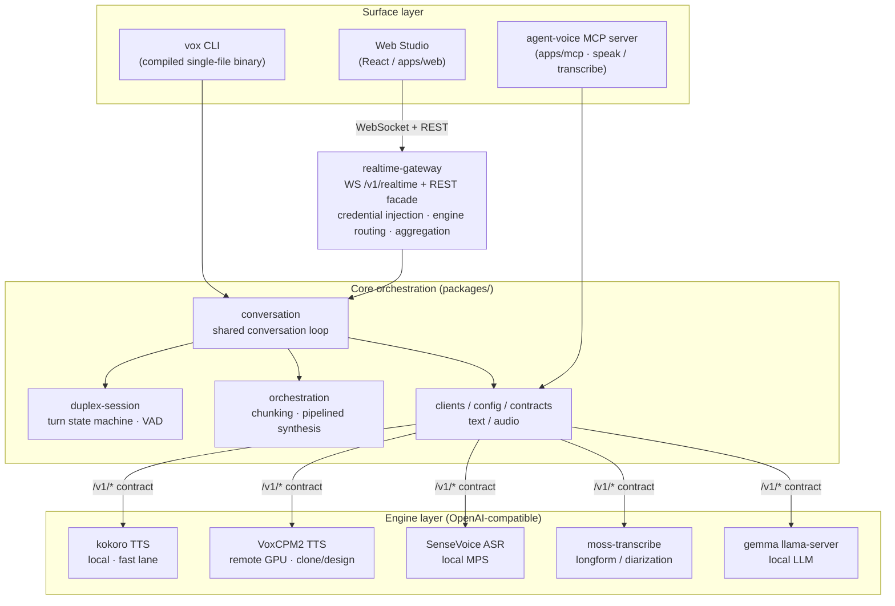
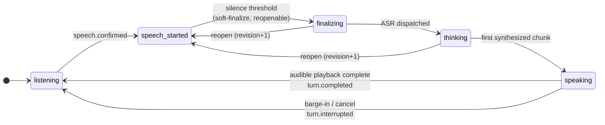

# VoxStudio Technical Report: Design, Implementation, and Empirical Evaluation of a Self-Hosted Multilingual Voice Interaction System

**A multi-engine speech stack, full-duplex conversation kernel, realtime gateway, and browser studio behind one OpenAI-compatible contract**

| Version | Report date | Code scope | Development period |
|---|---|---|---|
| 1.2 | 2026-07-22 | `voxstudio@main` as of `bd48313` | 2026-07-11 – 2026-07-22 |

> This file is the report's single source of truth (Markdown). The distributable HTML is not committed; build it on demand: `bun run build:report` → `docs/technical-report.html` (inlined styles and pre-rendered figures, offline self-contained). See Appendix B for version history.

## Abstract

This report is a systematic account of VoxStudio — a self-hosted, multilingual voice input/output product system — covering its architecture, key algorithms, engineering decisions, and empirical measurements. The system places ASR, LLM, and TTS engines behind a single OpenAI-compatible contract, and builds on top of it a platform-neutral full-duplex conversation kernel (VAD segmentation, provisional barge-in confirmation, speculative turn-taking), a realtime WebSocket gateway with idempotency and reconnection semantics, and a browser studio covering conversation, generation, voice management, and reproducibility auditing. Every key metric is reported as measured: the speaker-duplex echo gates (both the energy and Silero detectors achieved 0 self-interruptions and 12/12 operator barge-ins), the complete path that took end-to-end conversation latency from 8.5 s to p50 ≈ 2.1 s on the fully local stack, a Chinese ASR character error rate of 5.8%, and fingerprint-grade (SHA-256) reproducibility verification of designed voices. The report also analyzes five failure cases of scientific interest — a same-day dual-engine deadlock triggered by streaming disconnects, timbre/rate drift from continuation conditioning feedback in autoregressive TTS (with the v1.1 revision: one-hop adjacency still random-walks; only an immutable anchor is drift-safe), misplaced playback-clock ownership, a cross-backend misjudgment of speculative-decoding gains, and a three-layer localization of the bandwidth/underrun/buffer-granularity degradation behind remote-audio "noise" — and distills a "measured gates" engineering methodology. Every conclusion is annotated with its measurement date and environment. v1.1 additionally records the Web Studio's single-binary delivery form (`vox studio`) and the Opus wire format for streamed TTS. v1.2 extends the system in four directions and the methodology in one: **interoperability** (an OpenAI Realtime dialect adapter — official SDKs connect by changing a base URL); **agency** (a voice-driven tool loop with MCP in both directions: external tools enter the conversation behind a spoken-confirmation flow, and the system's own voice I/O is served to other agents over MCP); **conversation quality** (a first-chunk clause fast path taking end-of-speech→first-audio to ~1.0 s on long replies, and agent-initiated turns — welcome, silence nudge, pronunciation overrides); and **operability** (the captures library closing the ASR data flywheel with a curated-work-preserving retention quota, demo guardrails, and a WASM Silero backend that makes the compiled binary's certified barge-in detection fully self-contained). Methodologically, v1.2 promotes the same-day adversarial review — a heterogeneous reviewer over each delivery day's diff — to a named practice, on the strength of four rounds that each caught real composite-state defects outside any gate's frame.

Keywords: voice interaction; full-duplex conversation; voice activity detection; barge-in; streaming synthesis; reproducibility; OpenAI-compatible contract; self-hosted

## 1 Introduction

Hosted voice APIs present three structural problems in this product's context: data leaving the premises, wide-area latency (measured RTT of 400–1300 ms between the local workstation and the remote GPU host), and uncontrolled evolution of models and voices. VoxStudio's goal is a **fully self-hosted** voice interaction system satisfying four design goals:

- **Swappable engines**: moving any ASR/LLM/TTS engine between hosted and local must be nothing more than a base-URL change;
- **Full-duplex conversation**: real barge-in and natural turn-taking, without self-interruption from speaker echo;
- **Reproducibility**: voice-design artifacts (design profiles) must be byte-for-byte reproducible on the same runtime, and auditable;
- **Measured gates**: no experience- or safety-relevant feature is accepted on subjective demos — only on real-device measurement gates with numbers.

In terms of design lineage, the system references voicebox [2] (an information-architecture reference; self-described as batch generation with no two-way conversation) and Hugging Face `speech-to-speech` [3] (best-practice stages of a cascaded pipeline), and takes "realtime full-duplex conversation" as its core differentiator from that lineage.

The main contributions of this report:

1. A multi-engine architecture whose only engine boundary is the OpenAI-compatible contract, with its registry routing semantics (instances/roles/capabilities, §3);
2. A platform-neutral full-duplex conversation kernel — provisional barge-in confirmation and speculative turn-taking — with real-device promotion gates carrying numbers (§4, §8.1);
3. Realtime session protocol v1: idempotent, reconnectable, with the audible clock owned by the endpoint (§5);
4. A fingerprint-grade (SHA-256) reproducibility system for designed voices, with cross-surface reproduction evidence (§7);
5. Five failure case studies with quantified root-cause analyses, and the "measured gates" engineering methodology (§9–10);
6. (v1.2) A bidirectional agent story — external tools entering the voice loop behind spoken confirmation, and the system's voice serving other agents — plus wire-level interoperability with the OpenAI Realtime ecosystem (§4.7, §5, §6).

## 2 System Architecture

The system has three layers: the **engine layer** (independent OpenAI-compatible HTTP services), the **core orchestration layer** (platform-neutral TypeScript packages), and the **surface layer** (CLI, realtime gateway, browser studio, and — since v1.2 — an MCP server giving other agents the system's voice I/O). The core never touches a concrete engine brand — only the contract endpoints: `/v1/audio/speech`, `/v1/audio/transcriptions`, `/v1/chat/completions`, plus the `/v1/voices` and `/v1/design-profiles` extensions.

**Figure 1**　System layering. The browser talks only to the gateway — engine addresses and credentials never reach the client; the CLI and the gateway share one conversation-loop implementation (§4), so the certified lifecycle exists as exactly one piece of code.

### 2.1 Key boundary conventions

- **Public-repo boundary**: secrets, internal network topology, and machine details never enter the public repository; operational events are recorded in an internal ops-log repository.
- **No empty directories**: every delivery phase is introduced by its first tested module — no scaffolding shells.
- **Certified lifecycles never fork**: gate-certified logic such as VAD segmentation and barge-in policy is extracted into shared implementations (`VadSegmentAssembler`, `packages/conversation`); detectors and surfaces adapt to them and never copy them.

## 3 Engine Layer and the Engine Registry

### 3.1 The registry: instances / roles / capabilities

Single slots (one engine per kind) fail quickly in practice: conversation wants low-latency TTS while voice registration wants clone-capable TTS; realtime ASR and long-form transcription are two different engines. The registry design (`docs/engine-registry.md`, settled 2026-07-15) separates **instances** from **roles**: `engines:` declares arbitrarily named instances (carrying `kind` and `capabilities` tags) and `roles:` assigns instances to product roles. Selection is three-tiered: **explicit** (`?engine=`, session-level `ttsEngine`; a typo returns 400 rather than misrouting) → **capability** (voice registration auto-routes to the first instance declaring `clone`) → **role default**. Legacy configurations (instances named after roles) are the degenerate case of the new model, fully backward compatible.

| Instance | Kind | Model | Placement | Role | Capability tags |
|---|---|---|---|---|---|
| kokoro | tts | Kokoro-82M-v1.1-zh | local (M3 Max, CPU) | `tts` (conversation fast lane) | preset, fast |
| voxcpm2 | tts | VoxCPM2 (48 kHz) | remote GPU host | — (routed by capability) | clone, design, streaming |
| sensevoice | asr | SenseVoice-Small | local (MPS) | `asr` | — |
| moss | asr | moss-transcribe-diarize | local | `asr_longform` | longform, diarize |
| gemma | llm | gemma4-12B-it-qat (llama-server) | local | `llm` | — |

**Table 1**　The production engine registry as of the report date. The gateway endpoint `GET /v1/engines` serves a sanitized form of this table (with live health and runtime model identity; without addresses or credentials).

### 3.2 The VoxCPM2 service (our wrapper)

Productionizing the quality-line TTS involves five key mechanisms:

- **Prompt-cache reuse**: encoding the reference audio through the VAE dominates the fixed cost of a reply's first chunk; a content-addressed LRU cache (audio fingerprint + prompt text) encodes each voice exactly once.
- **Streaming synthesis**: with `stream: true` the service emits chunked `f32le` PCM (sample rate declared by an `X-Sample-Rate` header), so first audio leaves the server before the full generation finishes. On the remote link this took first audio from ~5 s to ~1 s.
- **Continuation sessions**: multi-chunk synthesis shares one `continuation_id` for cross-chunk prosodic continuity. *The merge policy is a key correction of this report — see §9.2.*
- **Disconnect safety**: lock-acquisition timeouts plus deterministic closing of async body iterators — see §9.1.
- **Opus wire format (v1.1)**: streaming requests with `response_format: opus` emit Ogg/Opus (default 96 kbps ≈ 12 KB/s) — raw f32 PCM at 48 kHz needs 187.5 KB/s, which a slow WAN link cannot carry (§9.5). The encoder is an ffmpeg pipe wrapped around the already-primed PCM generator; busy-503 semantics and the lock-release rules (§9.1) are fully preserved. The client negotiates opus only when both gates hold — the engine is configured for it *and* the consumer has a decoder — otherwise the request stays raw PCM.

### 3.3 Local engines and alternatives evaluated

- **Kokoro-82M-v1.1-zh**: a fixed bank of 103 Chinese voices; embedded English is routed through `en_callable` to an English G2P (without it, English words are mangled by the Chinese pipeline — confirmed by measurement, then fixed). As the conversation fast lane, first audio is ~0.2 s.
- **SenseVoice-Small**: the conversation-slot ASR. MPS (Metal) acceleration took single-utterance inference from 475 ms to 26 ms (18×), which removed the need for the "streaming ASR" backlog item — batch is fast enough.
- **VoxCPM.cpp** [4] (GGUF q4_k, CPU): measured end-to-end RTF on the M3 Max of 1.78 (8 threads, timesteps 10) and 1.11 (12 threads, timesteps 6) — both beyond the realtime line, **unfit for conversational streaming**; positioned for offline clone synthesis and as a fallback when the GPU host is unavailable.
- **macOS `say`**: on the same sentence (10 s of audio: 0.71 s synthesis vs Kokoro's 0.95 s including HTTP) speed is comparable, but the parametric-vs-neural quality gap is obvious; verdict — not a product engine, retained as a zero-dependency system chime.

## 4 The Full-Duplex Conversation Kernel

### 4.1 Turn state machine and cancellation semantics

`DuplexSession` is the platform-neutral turn kernel: strict state transitions, a per-turn `AbortSignal`, a sequence-numbered event stream, and bounded playback queues. Any superseded work (an interrupted reply, a revision replaced by reopen) is cancelled through abort propagation — no "zombie replies".

**Figure 2**　The turn state machine (simplified). `speaking` is the speculative policy's "commitment point": user speech resuming after it takes the barge-in path, not reopen. A `turn.timing` event is emitted however a turn ends, carrying millisecond offsets for vad_end / asr_done / llm_first / tts_first_audio / playback_first.

### 4.2 VAD: two detectors, one segment lifecycle

The segment lifecycle (pre-roll retention, provisional start, `minSpeechMs` confirmation, silence/overlength ends, noise drops) is implemented once in `VadSegmentAssembler`; the two detectors provide only the per-window "is this audio voiced" judgment:

- **Energy detector**: RMS threshold (default 0.01).
- **Silero VAD v5.1.2** [6] (ONNX): 512-sample windows (32 ms), hysteresis probability thresholds 0.5/0.35 for entering/leaving speech. The model is pinned by version and SHA-256, fetched into a verified local cache on first use (a hash mismatch refuses to load); per-window inference is sub-millisecond.
- **Level pre-gate**: an RMS gate (default 0.01) in front of Silero. This is a **measured necessity, not an optimization**: residual echo after cancellation is by nature "quiet speech", and a good speech model is exactly what recognizes it — re-scoring the certified gate captures showed Silero confirming self-interruptions on residual echo the energy detector never saw.

### 4.3 Provisional barge-in

`speech.start` fires on a single above-threshold detection unit (one capture frame for the energy detector; one 32 ms window for Silero) — a single transient knock or echo spike can trigger it. If playback stopped on start, one transient would destroy an entire reply. The policy: **playback stops only on `speech.confirmed`** (minSpeechMs of accumulated voiced audio); an unconfirmed trigger is recorded as `turn.false_barge_in` and the reply keeps playing. The VAD's pre-roll guarantees no speech is lost before confirmation.

### 4.4 Speculative turn-taking

The conservative policy waits 650 ms of silence before ending a turn — a tax charged to every reply. The speculative policy **soft-ends** at 150 ms of silence and dispatches immediately (ASR→LLM→TTS all start early); if the user resumes speaking within the reopen window (default 7 s), the turn **reopens** (revision +1, aborting the superseded revision's in-flight work) and redispatches with the merged utterance. The commitment point is `speaking`: once the reply starts playing, resumed speech is barge-in rather than reopen — barge-in keeps its certified confirmation bar, while reopen needs only a single-frame trigger (the cost of a wrong reopen is one aborted speculative dispatch, with nothing audible lost). Promotion gate: 0 wrong reopens; stop-of-speech→first-audio p50 1.67 s, about 0.46 s better than conservative (2026-07-14; 18 reopens across 14 turns, all correct).

### 4.5 The streaming reply pipeline

The LLM streams over SSE (an engine that answers whole JSON degrades to a single delta); `SentenceAssembler` builds complete sentences from the delta stream; **the first complete sentence is synthesized immediately** (it *is* the reply's first-audio latency), later sentences accumulate into chunks under a growth cap, and one TTS continuation session spans the reply. The conversation-scenario first-chunk cap is 2.5 s of estimated speech (8 s for long-form) — every extra second in the first chunk is a second of dead air, while inter-sentence seams are inaudible in conversation. The chunk growth cap is 8 s (down from 15 s; see §9.2 for why). Conversation history keeps the last 16 messages (8 exchanges), and **only exchanges that completed and were actually heard** enter subsequent context — replies interrupted mid-generation and revisions replaced by reopen leave no trace; this is simultaneously a privacy boundary and a context-consistency constraint.

### 4.6 The first-chunk clause fast path (v1.2)

After the stack localization and speculative promotion, `turn.timing` decomposition showed the dominant residual cost was `llm_first → speaking`: waiting for the LLM to finish the reply's first *sentence* before synthesis may begin (the streaming-ASR alternative was data-refuted the same day — the whole ASR leg is 100–134 ms, ~8% of end-to-end; see Table 4). The fast path attacks the actual bottleneck: once a reply's un-terminated text already speaks for 1.2 s (config: `chunking.first_clause_seconds`), the first chunk may end at clause punctuation (digit-guarded ASCII separators, closing quotes riding along); every later chunk keeps the sentence rule, so at most one seam can fall mid-sentence, cushioned by the same `join_pause_ms` every seam gets. Measured (2026-07-19, interleaved A/B on the same long-answer question): `llm_first → speaking` fell from 1057–1124 ms to **638–659 ms (−40%)**, taking end-of-speech → first audio to **~1.0 s**; short-first-sentence replies never trigger the path and are unchanged. The seam was judged not noticeable by ear in live Web Studio conversation. Long-form reading (`vox say`) is seam-bound rather than latency-bound and stays sentence-only.

### 4.7 Tool calling: the loop, MCP, and spoken confirmation (v1.2)

The conversation loop gained voice-driven tool calling (2026-07-18/19): tools register as `ConversationTool`s with JSON-Schema parameters; the LLM's function calls execute mid-turn and their results feed the spoken reply. The system is an **MCP client**: servers declared in config are connected once per surface via the official SDK, their tools bridged into the same registration built-in session tools use. The safety boundary rides tool **effects**: a `readOnlyHint`-annotated (or built-in read-only) tool executes without ceremony, while the first `effect: "external"` tools forced the confirmation flow the design had deferred — an external call is *parked*, the agent asks out loud, and only an explicit `confirm_action` executes it ("确认" lands it, "算了" cancels, an unrelated utterance does neither; nothing executes without the confirming call). Gate (`bun run measure:mcp`, live gemma + a real stdio server): explicit commands invoked the right MCP tool with exact arguments, the park→ask→confirm→execute→read-back loop closed, decoys 0/3, zero invented tools, zero malformed JSON. One finding folded back: a bare pending line let the model *say* it cancelled without calling `cancel_action` — the same claiming-without-calling failure the original tool spike measured, fixed the same way (a hard sentence in the pending system line, re-measured). The Web captions render `tool.call` / `tool.result` chips and an amber `tool.pending` chip for the confirmation window.

The mirror surface, **agent-voice MCP** (`apps/mcp`): a thin MCP *server* over the engine contract giving any MCP client — Claude Code with one config line — `speak` / `transcribe` / `list_voices` on this machine. First use is the self-hosted notification path: a long task finishes and the agent says so through the local speakers. Gate passed with the official SDK client against live engines (2026-07-19).

### 4.8 Conversation etiquette: agent-initiated turns (v1.2)

Three cheap adoptions from a competitive survey of hosted voice agents, taken on our terms (2026-07-19). The primitive is one new kernel edge — `startAgentTurn()`: from idle `listening`, a turn is created directly in `finalizing` with no user-speech states and no VAD; everything downstream (abort signal, timing event, **barge-in path**) is the existing machinery, so an agent turn is interruptible exactly like any reply, and the kernel refuses the edge in any other state — the agent never talks over the user. On it ride: a **welcome** line (speaks once at loop start), a **silence nudge** (arms after each audibly-completed exchange, fires at most once per gap, disarms on any speech), and **pronunciation overrides** (term→reading substitutions at the TTS boundary only — captions and history keep the spelling; the mirror twin of ASR keyterms). All opt-in, off by default — etiquette is a choice, not ambience; a completed agent turn enters history (the model knows it greeted), an interrupted one leaves no trace (the heard-only rule, unchanged). Model-generated nudge text is deferred behind its own future gate; the fixed text is deterministic and free.

## 5 The Realtime Gateway and Session Protocol v1

`apps/realtime-gateway` provides realtime sessions on top of the existing one-shot engines (rather than adding WebRTC semantics to each engine). Control rides JSON text frames; media rides binary frames (never base64): client-to-server is raw `f32le` 16 kHz mono PCM (timestamps stamped server-side from sample counts — client clocks stay out of the protocol); the sample rate of server-to-client reply audio is announced by a preceding `playback.format` event.

- **Envelope**: every event carries the protocol version, a monotonic `sequence`, the `sessionId`, and a timestamp.
- **Idempotent commands**: every command carries an `idempotencyKey`; a replay is acknowledged with `command.duplicate` and never re-executed; a `turn.interrupt` naming a superseded turn is rejected as `stale_turn` — "no stale command replays after reconnect" is enforced server-side rather than trusted to clients.
- **Reconnection**: a session survives its socket by a grace period (default 30 s); after `session.attach` the client resynchronizes from the pushed `session.snapshot` (no event-replay buffer — the snapshot *is* the resync mechanism).
- **The endpoint owns the audible clock (playbackAck)**: the gateway cannot hear the client's speaker. With `playbackAck` enabled, sending the last piece does not end the turn — it stays `speaking` (interruptible) until the client reports `playback.complete`, with a timeout capped by the audio's own duration plus slack (a mute client cannot wedge the session). This is the protocolization of the CLI lesson in §9.3.
- **REST facade**: contract endpoints proxied by the gateway with credentials injected server-side; `GET /v1/voices` returns the cross-engine **union voice bank** (entries attributed per engine; one engine down does not blank the bank — its absence shows in `/v1/engines`).
- **Bounded input buffering**: microphone input buffers at most 30 s gateway-side, dropping oldest first — when an engine stalls, the VAD sees a gap rather than unbounded memory, and the gateway never retains an unbounded live recording.
- **Secure defaults**: binds loopback by default; network exposure is a deployment decision (a tunnel plus access control), with an optional bearer-token gate.
- **OpenAI Realtime dialect (v1.2)**: a per-connection translation layer on the same `/v1/realtime` path — clients written for the OpenAI Realtime API (official SDKs, tooling for xAI's wire-identical endpoint) connect by changing only their base URL. The adapter speaks the GA wire shape, wraps a `GatewaySession` as an `EventSink` (the session neither knows nor cares), starts lazily on the first audio append, transcodes honestly at the boundary (base64 PCM16@24kHz ↔ the protocol's f32 16kHz through the shared `LinearResampler`), and carries client-declared function tools into the tool loop as first-class `ConversationTool`s. Deliberate subset: WebSocket only, `server_vad` only, audio conversation + function tools; unsupported shapes are rejected rather than mis-decoded. Gate passed with the official `openai` SDK against the live stack (2026-07-19).
- **Demo guardrails (v1.2)**: three deployment flags, all off by default, for putting a demo in front of strangers — `--max-sessions` (the N+1th conversation is refused with a structured capacity error; attach stays exempt), `--max-session-seconds` (every session notices its ceiling and stops), and `--demo` (registry writes 403 while reads stay — picking voices *is* the demo; MCP servers stay unconnected; the capture library stays off regardless of configuration — a demo must not retain visitor audio). Guardrail typos fail closed. Gate passed live with all three flags against real clients (2026-07-19).

## 6 The Web Studio

Five panels (Conversation / Generate / Voices / Library / Settings; all delivered as of v1.2), with Conversation as the headliner — the capability the design lineage (voicebox) explicitly lacks. React + TypeScript + Tailwind + Zustand; desktop gets a left rail, mobile a top bar plus a safe-area bottom tab bar, with a site-wide `max-w-6xl` content column and dynamic viewport height (`100dvh`). Since v1.2 the shell is bilingual (Chinese/English i18n with the source string as the key — a missing translation is a compile error), every tab is a URL over the History API (deep links and refresh land on the right panel through the gateway's SPA fallback), and the etiquette options (§4.8) are Settings fields persisted in localStorage.

- **Conversation panel**: AudioWorklet capture (requesting AEC/NS/AGC) through a streaming linear resampler to the protocol's 16 kHz frames; gapless streamed PCM playback scheduling (a pure, testable timeline); live caption bubbles with turn state, reopen-merge ×N and noise-ignored ×N markers, and per-turn latency chips; the negotiated AEC/NS/AGC capability snapshot on screen. The voice picker is engine-grouped and **selection routes**: picking a clone voice moves that session's TTS onto the quality line.
- **Generate panel**: text→audio with duration/chunk estimates (shared `packages/text` running in the browser) and a takes history (inline player, download, delete).
- **Voices panel**: the union voice bank (search + automatic ID-prefix categories + engine badges + a fixed-height scrolling grid); voice registration by file upload or **in-browser recording** (recording deliberately disables AEC/NS/AGC — a reference sample wants the raw signal; WAV is encoded in the browser) with one-click ASR transcript drafting; the design-profiles section is §7.
- **Library panel (v1.2)**: the captures surface closing the ASR data flywheel. Retention is an explicit deployment opt-in (`vox studio --library DIR`, off by default; demo mode keeps it off regardless): every finalized utterance lands as WAV + SQLite metadata with the exact sidecar pairing the ASR reference workflow scores (`<id>.txt` = raw ASR text, never rewritten; an inline correction writes `<id>.ref.txt` beside it) — corrected captures feed the CER reference set with no export step, and one click promotes a capture (with its corrected text as the reference transcript) into a clone voice sample. Ingest is atomic (tmp-file writes with the row insert as commit point; startup reconciliation sweeps debris), per-capture mutations are serialized (a delete queues behind a promote's engine round-trip), and shutdown drains in-flight work. A retention quota (`--library-max-bytes`, plain bytes or K/M/G, typos fail closed) bounds retained audio by evicting the oldest **unpinned** captures — a capture with a human correction or a promotion is curated work and is never auto-deleted; once pinned captures alone fill the quota, new ingests are refused with a logged reason, and the bound holds even under the promote-vs-evict race (the newcomer rolls back). Gate: a live spoken turn retained → re-transcribed → corrected → promoted to a clone voice, end-to-end (2026-07-20).
- **Settings panel**: gateway health, the engine registry table (role badges, capability tags, health dots, runtime identity), and the endpoint capability snapshot.

**Delivery form (v1.1, completed v1.2)**: the `vox studio` subcommand packs the browser app, the realtime WebSocket, and the REST facade into **one compiled binary** — the vite build is embedded via a generated manifest of `with { type: "file" }` imports, so it runs from any directory with no dist on disk (verified by hiding dist). The app shell is served outside the bearer gate (a page load cannot carry a header, and the shell holds no secrets) while every `/v1` route stays guarded. v1.1's stated limit — no ONNX runtime in the binary, so barge-in detection degraded to the energy detector — closed in v1.2: the binary embeds onnxruntime-web's WASM backend and the SHA-verified Silero model itself (the model never enters the repository; a build-time tool embeds the verified cache copy), probe-measured identical to the native runtime within 2.4e-7 at 0.2 ms per 32 ms window, behind one process-shared inference session (per-stream state is 320 floats; RSS measured flat across 4000 session churns). Gate: the compiled binary, started from an unrelated directory with an **empty cache**, ran a full live conversational turn with `vad: silero` requested explicitly — no network, cache untouched. WebAssembly SIMD is the WASM path's stated hard prerequisite (onnxruntime-web ships only the SIMD build; every Bun target qualifies); the energy detector remains only as the both-runtimes-failed loud fallback.

## 7 The Reproducibility System

A designed voice (design profile) = a zero-shot voice pinned by an English voice description + anchor text + seed + cfg + timesteps, recorded together with the generating model identity, the model-manifest SHA-256, and the anchor audio's SHA-256. Three operations close the audit loop:

- **audit**: the profile's recorded model identity/manifest fingerprint vs the engine's live self-reported identity (in the Web UI, a live badge per profile: consistent / model drift / manifest drift);
- **verify (reproduce)**: regenerate under a throwaway ID with identical parameters, compare audio fingerprints, clean up the probe — an empirical fingerprint test of reproducibility (SHA-256 equality: cryptographic-strength evidence of byte-for-byte equivalence);
- **audition / select**: fixed-text, fixed-seed candidate auditions with a human selection record.

> **Measured result** — `design-calm-clear`, created via the CLI on 2026-07-12, was reproduced on 2026-07-15 through the Web path (browser → gateway facade → engine) with identical parameters: audio fingerprint `ecf6b51e5dc66f89…` **identical** (SHA-256 equality, i.e. cryptographic-strength byte-for-byte evidence) — which simultaneously proves this week's streaming, prompt-cache, and lock fixes did not disturb the batch path's determinism. All 7 existing design profiles audit green.

## 8 Empirical Evaluation

**Experimental setup** — The local workstation is an Apple M3 Max, 64 GB (macOS); the quality-line TTS runs on a single-GPU CUDA remote host (private overlay network, direct connection, across a WAN link). Software versions, dates, and detector/engine combinations are annotated per table.

**Data provenance** — The numbers in this section come from gate-program outputs and certified records in the design documents (`docs/duplex-audio-architecture.md` and peers); raw audio corpora and measurement artifacts are not distributed with the public repository, so outside readers cannot independently recompute them from source alone — treat them as "measured by the reporting party, with the documents as the record of custody".

### 8.1 Speaker-duplex echo gates (AEC gates)

Speaker mode (`--speaker-duplex`, the macOS AVAudioEngine Voice Processing helper) is accepted through real-device measurement gates covering: noise floor, voice-processing attenuation (explicitly *not* pure AEC ERLE), self-interruption rate against a silence baseline, capture-to-mute latency (bypass mode), double-talk (operator barge-ins cued by dual tones), and threshold sweeps. The gate program refuses to PASS incomplete or synthetic-stimulus runs.

| Metric | Energy detector (2026-07-13) | Silero (2026-07-14) |
|---|---|---|
| Confirmed self-interruptions (real TTS far-end playing) | 0 (13.2/min raw triggers absorbed by confirmation) | 0 (5.6/min raw model triggers absorbed by the level gate + confirmation) |
| Operator barge-ins heard | 12/12, none missed, none false | 12/12, none missed, none false |
| Barge-in detection latency p50 | 643 ms | **574 ms** (−69 ms) |
| Capture→mute p95 | 186 ms | same path reused |
| Direct-path voice-processing attenuation | 26.5 dB | same path reused |

**Table 2**　Gate records on built-in MacBook Pro speakers/microphone with real speech stimuli. Silero is the default detector everywhere as of v1.2 (native ONNX runtime in the workspace, the embedded WASM backend in the compiled binary — §6); the equally-certified energy detector remains as the loud fallback should both runtimes fail.

### 8.2 Conversation latency engineering

| Optimization step | Mechanism | Effect (measured) |
|---|---|---|
| Baseline (2026-07-13) | whole-reply LLM → whole-reply TTS, WAN engines | stop-of-speech→first-audio ≈ 8.5 s |
| First-chunk cap 2.5 s | compress the first synthesis chunk in conversation | first-audio wait sharply reduced (traded for one inaudible seam) |
| Sentence-level pipelining | SSE deltas → first sentence synthesized immediately; generation and synthesis overlap | eliminates the "wait for the whole reply" serialization |
| VoxCPM2 prompt cache + streaming | reference encoding reused; chunked PCM leaves early | remote first audio 5 s → ≈1 s |
| Stack localization (moved to the local workstation) | Kokoro TTS (first audio ≈0.22 s) + SenseVoice MPS + local llama-server | removes the structural 400–1300 ms WAN RTT |
| Speculative turn-taking promoted to default | 150 ms soft-end + reopen (§4.4) | −0.46 s; stop-of-speech→first-audio p50 1.67 s |
| **Converged state (2026-07-14)** | fully local chain | **stop-of-speech→audible reply p50 ≈ 2.1 s** |
| First-chunk clause fast path (2026-07-19, v1.2) | first chunk may end at clause punctuation once un-terminated text speaks ≥1.2 s (§4.6) | llm_first→speaking 1057–1124 → **638–659 ms (−40%)**; end-of-speech→first audio **~1.0 s** on long replies; short replies unchanged |

**Table 3**　The latency optimization path. For reference, a typical same-day (07-15) headless gateway replay `turn.timing`: from the user's speech onset, vad_end +1171 ms, asr_done +1275 ms, llm_first +1659 ms, tts_first_audio +2734 ms (including the 1.17 s utterance itself).

### 8.3 ASR and LLM

| Measurement | Conditions | Result |
|---|---|---|
| Chinese CER: SenseVoice-Small | 10-utterance real-user reference set (manually corrected) | **5.8%** |
| Chinese CER: nemotron-3.5-asr (previous conversation slot) | same set (after fixing the language parameter and stripping tags) | 17.9% |
| SenseVoice single-utterance inference | CPU → MPS (Metal) | 475 ms → **26 ms** (18×); HTTP round trip ≈90 ms |
| gemma4-12B-qat first token | local llama-server (source build) | **166 ms** (brew b9960 build: 265 ms) |
| MTP speculative decoding (same model pair) | CUDA (GPU host, systematic A/B, 2026-06) | 100 → **375 tok/s** (clear net gain) |
| MTP speculative decoding (same model pair) | Metal (M3 Max, 2026-07-14) | 60 → 19 chars/s (net slowdown) |
| ASR-leg share of end-to-end latency (v1.2) | five live-replay turns, `turn.timing` offsets (2026-07-19) | **100–134 ms, ~8%** — the "streaming ASR" backlog item retired on this number; the bottleneck was first-sentence accumulation, attacked instead by §4.6 |

**Table 4**　Recognition- and generation-side measurements. For the methodological meaning of the MTP rows, see §9.4.

### 8.4 Test and verification coverage

- TypeScript workspace: **324 tests / 34 files** (all green on the report date; 236/26 at v1.1), covering the turn kernel, VAD assembly, the conversation loop (simulated end-to-end, tools and etiquette included), the gateway protocol (simulated duplex over a real WebSocket; reconnect/idempotency/expiry grace; facade routing and credential injection; multi-engine registry routing; the OpenAI dialect; guardrails), the capture library (atomicity, mutation races, quota eviction with the promote/evict race), the Silero shared backend (cross-stream state isolation; churn cost), and the web client (a mock-socket reconnect state machine, plus mathematical invariants of the streaming resampler and playback timeline).
- Live measurement gates as named programs: **eight** `measure:*` scripts (aec, tools, openai, mcp, agent-voice, etiquette, guardrails, library) — each feature's acceptance run is re-executable against the live stack, not a one-off.
- Engine side: the Kokoro service has 8 pytest cases (including two deadlock regressions, §9.1); VoxCPM2's helper modules (continuation store, fingerprints, prompt-cache keys) are unit-tested; its lockfile resolves only on x86_64-linux, so store assertions execute in the GPU host's real environment.
- Debug infrastructure: `tools/live-replay.ts` (headless end-to-end replay against real engines — the localization tool of §9.1) and the gateway's operational session-event log (milestones and errors only; never transcript text).

## 9 Failure Case Studies

All five failures below occurred, were localized, fixed, and regression-verified within the reporting period; their mechanisms generalize beyond this system.

### 9.1 Case 1: streaming-disconnect service deadlock (two engines, same day)

**Symptom** — Replies went "audio first, then silence"; the session stuck at thinking forever; the service process alive, the port listening, yet every request — `/health` included — timed out. Kokoro (local) and VoxCPM2 (GPU host) fell the same day, one after the other.

**Mechanism** — Both services' synthesis paths were "**synchronous generators holding a `threading.Lock` across yields**" fed to StreamingResponse. Every barge-in in a full-duplex conversation aborts a streaming request; the abandoned generator stays suspended at a yield and its `with lock:` never exits. Starlette does not guarantee closing *synchronous* body iterators on disconnect — the original comment "client disconnect releases it through the finally" was precisely the falsified assumption. `/health` shared the same timeout-less lock with generation, so the whole service died externally.

**Fix** — ① Prime the first chunk before the response starts (a lock timeout surfaces as a real 503 `pipeline_busy`, not a broken 200 stream); ② switch to **async** body iterators (Starlette closes them deterministically on disconnect) with a `finally` that explicitly closes the synthesis generator → the lock is always released; ③ all lock acquisitions go through a timeout context; ④ VoxCPM2's `/health` waits at most 2 s for the lock and reports `busy: true` instead of queueing (Kokoro's health endpoint never took the generation lock).

**Regression** — Unit: after an abandoned stream, the next request must synthesize. Real device: after aborting a 2 s streamed synthesis, `/health` answered in 53 ms and the next synthesis returned 200 in 0.49 s (before the fix, the same sequence = permanent wedge).

> **Lesson 9.1** — A lock-holding generator + StreamingResponse(synchronous iterator) = deadlock on client disconnect. The iron rules for streaming engine wrappers: async body iterator + explicit close in finally + lock-acquisition timeouts; and the health check must never contend on the generation path's timeout-less lock — an unreachable health endpoint is the first signal of the wedge.

### 9.2 Case 2: timbre and rate drift from continuation conditioning feedback

**Symptom** — Long replies in a cloned voice drifted "less and less like the reference, faster and faster" toward the end.

**Mechanism** — Two factors stacked. **(a)** The continuation merge used the **rolling cache** as its base: chunk N's conditioning accumulated the **synthesized audio features of every earlier chunk**, progressively diluting the clean reference — the classic exposure-bias feedback loop of autoregressive systems; timbre and rate drift share this one source. **(b)** Conversation chunks doubled from 2.5 s up to a 15 s cap, so **the longest chunk (with the most within-generation drift) always landed at the end of a long reply** — two drifts compounding at the tail.

**Fix** — ① The continuation store gained a **base anchor** (clone = the pure reference cache; designed voices = the first chunk), and every merge re-anchored: chunk N conditioned on "reference + chunk N−1" only — seam prosody kept (from the immediate neighbor), drift propagating at most one hop; ② conversation chunk cap 15 s → 8 s.

**Verification** — Store logic asserted in the GPU host environment; a three-chunk continuation session verified mechanically; the user confirmed by ear that long replies held timbre and rate (2026-07-15).

**Revision: recurrence (2026-07-16)** — Rate drift in long replies recurred. Deployment checks ruled out a rollback (the running process's files matched the repo HEAD md5) — the fix was incomplete: chunk N's rate imitates chunk N−1 more than the reference, so "reference + one-hop adjacency" is still a **first-order Markov chain**, and prosodic statistics random-walk along it. Quantified reproduction: the same sentence placed at positions 1/3/5 of one session rendered 8.00 → 7.20 → 6.56 s (rate **+22%**, with both alternating text tracks accelerating monotonically); the control (same texts as independent requests) showed no trend (±10% noise). Why the first by-ear acceptance passed it: short samples cannot expose cumulative defects.

**Root fix** — Chunks 2..N condition on the **immutable anchor** alone: clone voices reuse the pure reference cache untouched (merge no longer called); reference-less sessions (design/free voices) keep "first chunk becomes the anchor" — without it, every later chunk would be a different random voice. Post-fix, two rounds of the same measurement: the rate curve flat (±5%, matching the independent-request noise signature); the user confirmed by ear.

> **Lesson 9.2 (revised in v1.1)** — "Conditioning on a rolling cache" is a drift amplifier, and "reference + one-hop adjacency" merely swaps the amplifier for a random walk — prosodic statistics drift all the same. **Only an immutable anchor is drift-safe.** Moreover: by-ear acceptance is insufficient for cumulative defects; regressions need position-aligned quantitative measurement (duration curves of identical text across session positions).

### 9.3 Case 3: misplaced playback-clock ownership ("cannot interrupt")

**Symptom** — In CLI speaker mode, the audible tail of a reply could not be interrupted; the interruption opened a new turn yet failed to stop the audio still playing.

**Mechanism** — "Last byte handed to the playback pipe" was mistaken for "reply finished playing": the session flipped back to listening early, speech during the tail opened a new turn instead of barging in, and nobody owned stopping the old audio.

**Fix and generalization** — CLI side: the turn stays speaking until the player's close() (the player holds the true audio clock). Protocol side: the lesson was **protocolized** as `playbackAck`/`playback.complete` — the gateway cannot hear the client's speaker, so the audible clock belongs to the endpoint; the server caps the wait by the audio's own duration plus slack, so a mute client cannot wedge the session.

> **Lesson 9.3** — In distributed audio systems, "finished sending" ≠ "finished sounding". The audible clock must belong to the party that can hear it, with physical duration as the fallback bound.

### 9.4 Case 4: cross-backend misjudgment of speculative-decoding gains (a methodology incident)

**Event** — From the Metal platform's 14–20% draft acceptance rate, we briefly concluded "MTP on the GPU host is dead weight — remove it"; this conflicted with prior systematic testing, and after the user's correction we re-examined the CUDA records (100 → 375 tok/s) and published a retraction.

**Mechanism** — **Acceptance rate is the wrong metric.** The correct frame is "mean accepted length × per-unit verification cost": for the same model pair, CUDA's batched verification is nearly free, so mean accepted lengths of 1.7–3.5 already yield >3× net gains; Metal's verification cost structure turns the same acceptance statistics into a net slowdown (60 → 19 chars/s). Speculative-decoding gains are a **backend property**, not a model-pair property.

> **Lesson 9.4** — Cross-machine/cross-backend performance conclusions require end-to-end A/B on the target host; they cannot be extrapolated from a single proxy metric. The retraction was written back into the ops records and the engine documentation.

### 9.5 Case 5: three-layer degradation behind remote-audio "noise" (v1.1)

**Symptom** — Conversation in a cloned voice (remote GPU engine): first, long "TTS can't keep up" stalls; after enabling compression, "a stretch of gritty noise mid-reply that clears up later" — three distinct mechanisms sharing one "noise/stall" symptom in sequence.

**Layer 1: bandwidth** — Inference was innocent (engine-local RTF 0.30, TTFB 0.15 s, GPU idle); the bottleneck was the WAN link — a direct private-overlay connection carrying only **30–65 KB/s**, while f32 PCM at 48 kHz needs **187.5 KB/s** to sustain realtime. 8 s of audio took 38–49 s to cross. **Fix**: the Ogg/Opus wire format (96 kbps ≈ 12 KB/s, still 5× headroom); 8 s of audio now crosses in **3.5 s**.

**Layer 2: underrun scheduling** — With Opus enabled, gritty noise appeared mid-reply. Evidence first, to exonerate codec and transport: the same deterministic synthesis (same seed, same anchor) fetched over both the PCM and Opus paths, compared by **windowed (250 ms) SNR** — p50 25.6 dB, no difference across chunks, no locally degraded window, and decoded length sample-aligned (codec-delay trimming exact). Only the playback side remained: on underrun, the timeline resumed each late-arriving network burst "immediately, with gaps between bursts" — a string of micro-gaps shredding words. **Fix**: re-buffer on underrun — once the queue drains, pad 350 ms so the following pieces queue contiguously; the shredding becomes one clean pause. Fresh replies keep the 50 ms low-latency start.

**Layer 3: buffer granularity** — Still "gritty", clean at both ends and appearing mid-reply — consistent with "the reply opens on a large burst, then degrades to a generation-paced trickle". Measured decoder output: ffmpeg emits one ~20 ms PCM piece per Opus packet (median 20 ms across 168 pieces; 86 pieces ≤25 ms), so the browser schedules ~50 `AudioBufferSourceNode`s per second, and each boundary's start-time rounding fuses into continuous grit. **Fix**: coalesce decoded PCM to ≥240 ms before yielding (measured after: 23 pieces, median 260 ms, zero fragments) — restoring the raw-PCM era's network-chunk granularity, at which boundary rates are inaudible.

**Verification** — Each layer's fix measured and recorded; the final user verdict by ear: "completely fine this time" (2026-07-17).

> **Lesson 9.5** — The three failure classes of remote audio streaming (insufficient bandwidth, underrun scheduling, buffer granularity) all present as "noise"; they must be localized layer by layer with measurements — the step that excluded codec and transport wholesale, "windowed SNR over a deterministic dual-path synthesis", was the key to convergence. Two hard engineering rules fall out: WebAudio streaming playback buffers belong at hundred-millisecond granularity; and compression negotiation must be double-gated (server config + decoder present at the consumer) so the degradation path always works.

## 10 Engineering Methodology

- **Measured gates**: experience and safety features are accepted through real-device gates with numbers (§8.1's AEC gates, the speculative-policy promotion gate, Phase 3's fingerprint-equality gate). Gate programs actively resist cheating: an empty capture = fake perfect attenuation → FAIL; an unmeasured noise floor forbids claiming bounds; the AEC convergence window (3 s) is excluded from all statistics.
- **Documents first, decisions numbered**: every design under `docs/` (duplex, web-studio, engine-registry, chunking) is written as "numbered decisions + non-goals + phases + per-phase acceptance gates"; when implementation diverges, the document is amended rather than left to drift.
- **Certified logic, single implementation**: gate-certified code such as the VAD lifecycle and the conversation loop is extracted and shared (CLI and gateway both drive `packages/conversation`; after extraction the original 10 simulated duplex tests passed unchanged).
- **Loud degradation**: when Silero is unavailable, degrade loudly to the equally-certified energy detector; when explicitly requested, fail loudly. Any silent fallback (e.g. an empty voice defaulting to `clone`) is converted, the moment measurement exposes it, into "leave empty and let the engine decide".
- **Post-mortems on the record**: every real-device incident is filed in the ops repository as "symptom / mechanism / fix / regression / lesson", and the lesson is written back into product documents and code comments.
- **Adversarial review as the closing ritual (v1.2)**: after each substantial delivery day, a *heterogeneous* reviewer — a different model family than the one that wrote the code — reads the day's diff with an explicitly adversarial brief. Four rounds in this reporting period each caught real defects, and their common shape is instructive: **composite states outside any single gate's frame**. The guardrails review caught a stopped session's socket close re-arming the reconnect grace (a 30 s resource retention in exactly the hardened deployment); the library review caught three mutation races (a delete interleaving a promote's engine round-trip could resurrect sidecars); the quota review caught the advertised disk bound breaking under a promote-vs-evict race the author had misjudged as a transient; the VAD review caught an undisposable per-session inference session — a steady-state leak under connect/converse/disconnect churn that no functional gate would ever run long enough to see. The division of labor is now explicit: gates certify what they measure; adversarial review hunts what the gates were never framed to ask. Every finding is fixed with its own regression test the same day, and the review's own misses (none yet observed) would be filed the same way.

## 11 Limitations and Future Work

- **The browser double-talk gate has not run**: the conversation panel is implemented and in daily use, but before it is declared supported, real-browser/real-route double-talk and barge-in measurements must be completed with the same discipline as the macOS gate (including filing the negotiated capability snapshot). This is the oldest open gate in the system.
- **Deployment (Phase 5): the code half is complete, the ops half is not**: single-binary packaging is fully self-contained as of v1.2 (web app, WASM Silero, embedded model), and the demo guardrails are delivered and gated; hosting itself (a tunnel + access-controlled private deployment; mobile depends on it because getUserMedia requires HTTPS) lives in the internal ops repository and has not been executed. A public demo remains a separate abuse/cost decision.
- **No inter-instance fault tolerance**: the registry deliberately does no load balancing or failover (a downed instance = loud failure); conversation-chain engine calls inherit a 600 s client timeout — too loose for realtime, to be tightened into tiered timeouts.
- **Etiquette phase 2**: model-generated nudge text (the fixed text is deterministic and free; a generated nudge needs its own measured gate), and a follow-up policy richer than once-per-gap.
- **Agent-voice phase 2**: the HTTP transport (`--port`) so remote agents can reach the voice surface; phase 1 is stdio-only.
- **Other known items**: audio route-change handling, residual within-chunk drift (shrink chunks further or raise timesteps for non-first chunks), evaluating native voice processing for Windows/Linux endpoints, and LiveKit as the remote browser transport (still planned, not started).

## 12 Conclusion

VoxStudio demonstrates that under the discipline of a single OpenAI-compatible contract, self-hosted multilingual voice interaction can simultaneously achieve **a usable full-duplex experience** (0 self-interruptions, 12/12 barge-ins, stop-of-speech→reply p50 ≈ 2.1 s fully local, ~1.0 s to first audio on long replies with the clause fast path), **auditable reproducibility** (designed voices reproduce byte-for-byte across surfaces), **an evolvable multi-engine architecture** (role/capability routing makes "conversation on the fast lane, cloning on the quality line" configuration rather than code), and — as of v1.2 — **an agent story in both directions** (external tools entering the voice loop behind spoken confirmation; the system's own voice served to other agents over MCP; wire-level interoperability with the OpenAI Realtime ecosystem by base-URL change alone). The shared shape of this period's failures — the interaction of streaming lifecycles with resource ownership — suggests that the reliability core of realtime voice systems lies not in models but in **cancellation semantics**: who holds the lock, who owns the clock, and who cleans up on disconnect. Those answers are now encoded in the protocol and the tests.

## References

1. VoxStudio design documents: [duplex-audio-architecture.md](./duplex-audio-architecture.md) (session contract, VAD policy, gate records), [web-studio.md](./web-studio.md) (panels and phases), [engine-registry.md](./engine-registry.md) (multi-engine routing), [chunking.md](./chunking.md) (the empirical basis of long-text chunking); v1.2 additions: [tool-loop.md](./tool-loop.md), [mcp-tools.md](./mcp-tools.md), [agent-voice-mcp.md](./agent-voice-mcp.md), [openai-realtime-adapter.md](./openai-realtime-adapter.md), [conversation-etiquette.md](./conversation-etiquette.md), [public-demo.md](./public-demo.md), [competitive-voice-agents.md](./competitive-voice-agents.md).
2. Pine, J. *voicebox*. MIT License. <https://github.com/jamiepine/voicebox> — information-architecture lineage reference.
3. Hugging Face. *speech-to-speech*. <https://github.com/huggingface/speech-to-speech> — cascaded voice-conversation pipeline practice reference.
4. OpenBMB. *VoxCPM2*; upstream C++ port *liuzl/VoxCPM.cpp* (fork of bluryar/VoxCPM.cpp).
5. hexgrad. *Kokoro-82M-v1.1-zh*; FunAudioLLM. *SenseVoice-Small*.
6. Silero Team. *Silero VAD v5.1.2*. MIT License (distributed with SHA-256 pinning).
7. ggml-org. *llama.cpp* (gemma4 architecture support ≥ b9960).
8. *Model Context Protocol* (official TypeScript SDK, `@modelcontextprotocol/sdk`) — the tool bridge and the agent-voice server surface (§4.7).
9. OpenAI. *Realtime API* (GA wire shape; adopted wire-identically by xAI) — the dialect adapter's target (§5).

This report is compiled from first-hand records of the development process (design documents, gate outputs, commit history, operational event records); every number is a dated, environment-annotated measurement, never an extrapolation.

## Appendix A　Protocol events and commands (v1)

| Direction | Type | Notes |
|---|---|---|
| Client→server (commands, all with idempotency keys) | `session.start` / `session.attach` / `session.snapshot.request` / `session.stop` | session lifecycle; attach pushes a snapshot for resync |
| Client→server (commands, all with idempotency keys) | `turn.interrupt {turnId}` / `playback.complete {turnId}` | interrupt is turn-scoped (a superseded turn is rejected as stale_turn); playback.complete reports the audible clock |
| Server→client (events, monotonic sequence) | `session.state` / `session.snapshot` / `session.notice` | state-machine mirror and resync |
| Server→client (events, monotonic sequence) | `turn.started\|interrupted\|completed\|false_barge_in\|reopened` / `vad.end` / `turn.timing` | the full turn lifecycle and the per-turn latency profile |
| Server→client (events, monotonic sequence) | `transcript.final` / `response.text.delta\|final` (with revision) | caption stream; revision numbers keep superseded dispatches' stale text off screen |
| Server→client (events, monotonic sequence) | `playback.format\|ended\|interrupted` / `audio.*` / `command.accepted\|duplicate\|rejected` / `error` | media format announcements, queues, and command receipts |
| Server→client (events, monotonic sequence, v1.2) | `tool.call` / `tool.result` / `tool.pending` | the tool loop's caption stream; `tool.pending` marks an external call awaiting spoken confirmation (§4.7) |
| Alternate dialect (v1.2) | OpenAI Realtime GA wire shape on the same `/v1/realtime` path | per-connection translation; selected at upgrade by `?model=` / `openai-beta` header / `?protocol=openai` (§5) |
| REST facade | `/v1/audio/speech` · `/v1/audio/transcriptions` · `/v1/chat/completions` · `/v1/voices[/{id}]` · `/v1/design-profiles` · `/v1/engines` | synthesis/transcription/chat and voice/profile operations support explicit `?engine=` routing (aggregate endpoints excepted); credentials are always injected server-side |

## Appendix B　Version history

| Version | Date | Changes |
|---|---|---|
| 1.0 | 2026-07-15 | Initial edition: architecture / kernel / protocol / studio / reproducibility / empirical evaluation; failure cases 9.1–9.4. |
| 1.1 | 2026-07-17 | §9.2 revised (base anchoring falsified by recurrence → immutable anchor; +22% drift quantified, ±5% regression); new §9.5 three-layer localization of remote-audio degradation; §3.2 gains the Opus wire format; §6 gains the `vox studio` single-binary delivery; §11 Phase-5 status updated. Report source migrated to Markdown (this file) with HTML as a build artifact; canonical language switched to English (contents unchanged from the Chinese v1.1). |
| 1.2 | 2026-07-22 | New §4.6 (clause fast path, −40% llm_first→speaking, ~1.0 s to first audio), §4.7 (tool loop + MCP both directions + spoken confirmation), §4.8 (etiquette: agent-initiated turns); §5 gains the OpenAI Realtime dialect and the demo guardrails; §6 gains the Library panel with the curated-work-preserving retention quota, the bilingual/URL-routed shell, and the self-contained binary (WASM Silero + embedded model, empty-cache gate); Tables 2–4 and §8.4 updated (324 tests / 34 files; eight `measure:*` gate programs); §10 gains the adversarial-review closing ritual (four rounds, four real composite-state defects); §11 rewritten to current state. |
