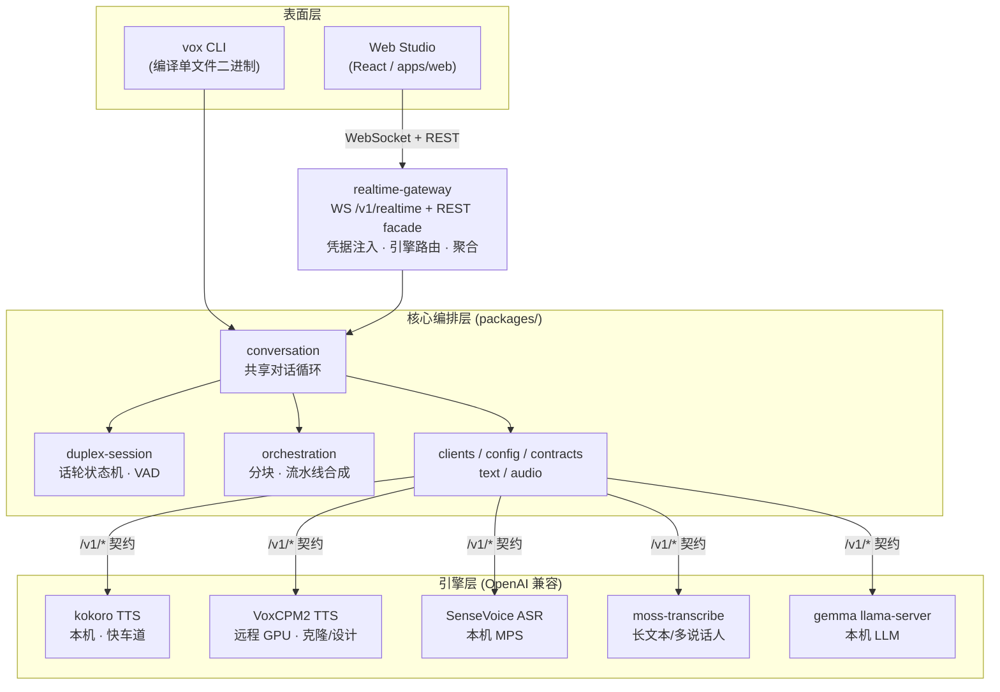
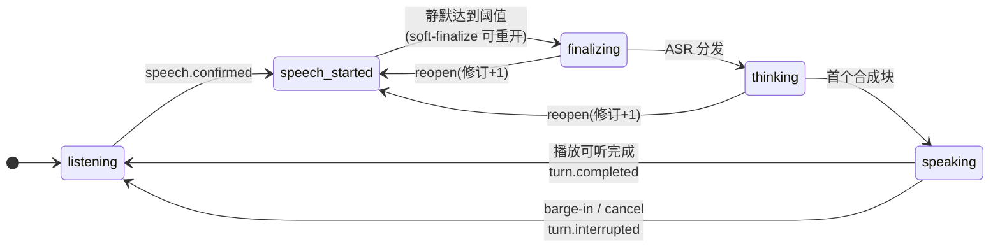

# VoxStudio 技术报告：自托管中文优先语音交互系统的设计、实现与实证评估

**统一 OpenAI 兼容契约下的多引擎语音栈、全双工对话内核、实时网关与浏览器工作台**

| 版本 | 报告日期 | 代码范围 | 开发周期 |
|---|---|---|---|
| 1.1 | 2026-07-15（v1.1 修订 2026-07-17） | `voxstudio@main` 截至 `e17c2d0` | 2026-07-11 – 2026-07-17 |

> 本文件为报告的唯一事实源（Markdown）。独立分发用的 HTML 不入库，按需生成：`bun run build:report` → `docs/technical-report.html`（内联样式与预渲染图，离线自包含）。版本演进见附录 B。

## 摘要

本报告系统性地整理 VoxStudio —— 一个自托管、中文优先的语音输入/输出产品系统 —— 的架构设计、关键算法、工程决策与实证测量。系统将 ASR、LLM、TTS 三类引擎统一在一层 OpenAI 兼容契约之后，其上构建平台无关的全双工对话内核（VAD 分段、暂定式打断确认、投机式话轮转换）、带幂等与断线重连语义的实时 WebSocket 网关，以及覆盖对话、生成、音色管理与可复现性审计的浏览器工作台。报告给出全部关键指标的实测值：扬声器双工回声门测（能量与 Silero 两种检测器均实现 0 次自打断、12/12 操作者打断命中）、对话端到端延迟从 8.5 s 优化至全本地栈 p50 ≈ 2.1 s 的完整路径、中文 ASR 字符错误率 5.8%、设计音色的指纹级（SHA-256）可复现验证等。报告还包含五起有科研价值的故障案例分析——流式请求断连引发的双引擎同日死锁、自回归 TTS 续段条件反馈导致的音色/语速漂移（含 v1.1 修订：一跳邻接仍会随机游走，唯有不可变锚是漂移安全的）、播放时钟归属错误、推测解码收益的跨后端误判、以及远程音频流「杂音」背后带宽/欠载/缓冲粒度的三层退化定位——并总结「实测门禁」工程方法论。所有结论均标注测量日期与环境。v1.1 另收录 Web Studio 的单二进制交付形态（`vox studio`）与流式 TTS 的 Opus 线格式。

关键词：语音交互；全双工对话；语音活动检测；打断（barge-in）；流式合成；可复现性；OpenAI 兼容契约；自托管

## 1 引言

托管语音 API 在中文场景下存在三类结构性问题：数据出域、广域链路延迟（本地工作站与远程 GPU 主机之间实测 RTT 400–1300 ms）、以及模型与音色的不可控演化。VoxStudio 的目标是构建一个**完全自托管**的语音交互系统，满足四项设计目标：

- **引擎可替换**：任何 ASR/LLM/TTS 引擎在托管与本地之间切换应当只是一次 base-URL 变更；

- **全双工对话**：支持真实打断（barge-in）与自然话轮转换，且不因扬声器回声产生自打断；

- **可复现性**：声音设计产物（design profiles）在同一运行时上可逐字节重现，并可被审计；

- **实测门禁**：任何涉及体验与安全的特性不以主观演示验收，而以带数字的真机测量门（gate）验收。

设计谱系上，系统对标 voicebox [2]（信息架构参考；其自述为批处理生成、无双向对话）与 Hugging Face `speech-to-speech` [3]（级联式管线的最佳实践步骤），并以「实时全双工对话」作为与谱系的核心差异点。

本报告的主要贡献：

1. 一套以 OpenAI 兼容契约为唯一引擎边界的多引擎架构及其注册表路由语义（实例/角色/能力，§3）；
2. 平台无关的全双工对话内核：暂定式打断确认与投机式话轮转换，及其带数字的真机转正门（§4、§8.1）；
3. 幂等、可断线重连、端点拥有可听时钟的实时会话协议 v1（§5）；
4. 设计音色的指纹级（SHA-256）可复现性体系与跨表面重现实证（§7）；
5. 五起带定量根因分析的故障案例研究与「实测门禁」工程方法论（§9–10）。

## 2 系统总体架构

系统分为三层：**引擎层**（各自独立的 OpenAI 兼容 HTTP 服务）、**核心编排层**（平台无关 TypeScript 包）、**表面层**（CLI、实时网关、浏览器工作台）。核心永不直接感知具体引擎品牌，只面向契约端点：`/v1/audio/speech`、`/v1/audio/transcriptions`、`/v1/chat/completions` 与扩展 `/v1/voices`、`/v1/design-profiles`。

**图 1**　系统分层。浏览器只与网关通信，引擎地址与密钥永不到达客户端；CLI 与网关共享同一份对话循环实现（§4），认证过的生命周期只有一份代码。

### 2.1 关键边界约定

- **公开仓边界**：密钥、内网拓扑、机器细节不入公开仓；运维事件记录于内部 oplog 仓。

- **无空目录交付**：每个交付阶段以「第一个被测试的模块」引入，不预建空壳。

- **认证生命周期不分叉**：VAD 分段、打断策略等经过门测认证的逻辑抽取为共享实现（`VadSegmentAssembler`、`packages/conversation`），检测器与表面各自适配、绝不复制。

## 3 引擎层与引擎注册表

### 3.1 引擎注册表：实例 / 角色 / 能力

单一槽位（每类一个引擎）在现实中迅速失效：对话需要低延迟 TTS 的同时，音色注册需要克隆型 TTS；实时 ASR 与长文本转写是两个引擎。注册表设计（`docs/engine-registry.md`，2026-07-15 定案）将**实例**与**角色**分离：`engines:` 声明任意命名实例（携带 `kind` 与 `capabilities` 标签），`roles:` 将实例指派给产品角色。选择语义为三级：**显式指定**（`?engine=`、会话级 `ttsEngine`，拼写错误返回 400 而非误路由）→ **能力路由**（音色注册自动路由到首个声明 `clone` 的实例）→ **角色默认**。旧式配置（以角色命名实例）是新模式的退化情形，完全向后兼容。

| 实例 | 类型 | 模型 | 部署位置 | 角色 | 能力标签 |
|---|---|---|---|---|---|
| kokoro | tts | Kokoro-82M-v1.1-zh | 本机（M3 Max，CPU） | `tts`（对话快车道） | preset, fast |
| voxcpm2 | tts | VoxCPM2（48 kHz） | 远程 GPU 主机 | —（按能力路由） | clone, design, streaming |
| sensevoice | asr | SenseVoice-Small | 本机（MPS） | `asr` | — |
| moss | asr | moss-transcribe-diarize | 本机 | `asr_longform` | longform, diarize |
| gemma | llm | gemma4-12B-it-qat（llama-server） | 本机 | `llm` | — |

**表 1**　报告日的生产引擎注册表。网关端点 `GET /v1/engines` 输出该表的脱敏形式（含实时健康与运行时模型身份，不含地址与密钥）。

### 3.2 VoxCPM2 服务（自研 wrapper）

对质量线 TTS 的工程化包含四项关键机制：

- **Prompt cache 复用**：参考音经 VAE 编码是首块回复的主导固定成本；按内容寻址（音频指纹 + prompt 文本）建 LRU 缓存，同一音色只编码一次。

- **流式合成**：`stream: true` 时以 chunked `f32le` PCM 输出（`X-Sample-Rate` 头声明采样率），首音频先于整段生成完成离开服务器。远程链路场景下首音频从 ~5 s 降至 ~1 s。

- **续段（continuation）会话**：多块合成共享一个 `continuation_id`，块间韵律连续。*合并策略为本报告的关键修正点，见 §9.2。*

- **断连安全**：拿锁超时 + 异步 body 迭代器确定性关闭，见 §9.1。

- **Opus 线格式（v1.1）**：流式请求 `response_format: opus` 时以 Ogg/Opus（默认 96 kbps ≈ 12 KB/s）输出——裸 f32 PCM@48kHz 需 187.5 KB/s，慢广域链路扛不住（§9.5）。编码为 ffmpeg 管道包装已 prime 的 PCM 生成器，busy-503 语义与锁释放规则（§9.1）全保留；客户端仅在「引擎配置 + 消费端有解码器」双门同时满足时协商，否则回落裸 PCM。

### 3.3 本机引擎与替代方案评估

- **Kokoro-82M-v1.1-zh**：103 个中文音色的固定音色库；英文夹杂经 `en_callable` 路由至英文 G2P（否则英文词被中文管线读坏，实测确认后修复）。作为对话快车道，首音频约 0.2 s。

- **SenseVoice-Small**：对话位 ASR。MPS（Metal）加速使单条推理从 475 ms 降至 26 ms（18×），使「流式 ASR」这一 backlog 项失去必要性——批式已足够快。

- **VoxCPM.cpp** [4]（GGUF q4_k，CPU）：实测 M3 Max 全流程 RTF 1.78（8 线程、timesteps 10）与 1.11（12 线程、timesteps 6），均超过实时线，**不适合对话流式**；定位为离线克隆合成与 GPU 主机不可用时的兜底。

- **macOS `say`**：同句对比（10 s 音频，合成 0.71 s vs Kokoro 0.95 s 含 HTTP）速度相当，但参数式与神经式的音质代差明显；结论为不作为产品引擎，保留为零依赖系统提示音。

## 4 全双工对话内核

### 4.1 话轮状态机与取消语义

`DuplexSession` 是平台无关的话轮内核：严格状态迁移、每话轮独立 `AbortSignal`、序号化事件流、有界播放队列。任何被取代的工作（被打断的回复、被 reopen 取代的修订）通过 abort 传播取消，杜绝「僵尸回复」。

**图 2**　话轮状态机（简化）。`speaking` 是投机策略的「承诺点」：此后恢复的用户语音走打断路径而非 reopen。`turn.timing` 事件在话轮以任何方式结束时发出，携带 vad_end / asr_done / llm_first / tts_first_audio / playback_first 等毫秒偏移。

### 4.2 VAD：双检测器与共享分段生命周期

分段生命周期（pre-roll 保留、暂定 start、`minSpeechMs` 确认、静默/超长结束、噪声丢弃）由 `VadSegmentAssembler` 单一实现，两种检测器仅提供「一段音频是否有声」的判断：

- **能量检测器**：RMS 阈值（默认 0.01）。

- **Silero VAD v5.1.2** [6]（ONNX）：512 样本窗（32 ms），进入/离开语音的滞回概率阈值 0.5/0.35。模型按版本与 SHA-256 双钉固定，首次使用时取入本地校验缓存，哈希不符拒绝加载；单窗推理亚毫秒级。

- **电平前置门（level pre-gate）**：Silero 前加 RMS 门（默认 0.01）。这是**实测出的必要项而非优化**：回声消除后的残余回声本质上是「小声的语音」，优秀的语音模型恰恰能识别它——用认证门测录音重打分显示 Silero 会将能量检测器根本看不见的残余回声确认为自打断。

### 4.3 暂定式打断（provisional barge-in）

`speech.start` 由单个越阈检测单元触发（能量检测器为一个采集帧，Silero 为一个 32 ms 窗）——一次瞬态敲击或回声尖峰即可引发。若以 start 即断播放，整条回复毁于一次瞬态。策略为：**播放只在 `speech.confirmed`（累计 minSpeechMs 有声音频）时停止**；未确认的触发记为 `turn.false_barge_in`，回复继续。VAD 的 pre-roll 保证确认前的语音不丢失。

### 4.4 投机式话轮转换（speculative turn-taking）

保守策略等待 650 ms 静默才结束话轮，这笔延迟全额进入每次回复。投机策略在 150 ms 静默即**软结束**并立刻分发（ASR→LLM→TTS 全链提前起跑）；若用户在 reopen 窗口（默认 7 s）内继续说话，话轮**重开**（修订号 +1，中止被取代修订的在途工作），以合并后的完整话语重新分发。承诺点为 `speaking`：一旦回复开播，恢复语音即为打断而非 reopen——打断保持其认证标准（须确认），而 reopen 只需单帧触发（错误 reopen 的代价只是一次被中止的投机分发，无可听损失）。转正门测：0 次错误 reopen；停话→首音频 p50 1.67 s，较保守策略改善约 0.46 s（2026-07-14，14 轮实测 18 次 reopen 全部正确）。

### 4.5 流式回复管线

LLM 以 SSE 流式输出（对只回整段 JSON 的引擎自动退化为单增量）；`SentenceAssembler` 从增量流中组装完整句子；**首个完整句立即合成**（它就是回复的首音频延迟），后续句子按增长上限聚块，全程共享一个 TTS 续段会话。对话场景首块上限压至 2.5 s 估计语速（长文场景为 8 s）——首块每多 1 s 就是 1 s 死寂，而句间拼缝在对话里不可闻。块增长上限为 8 s（原 15 s，压低原因见 §9.2）。对话历史保留最近 16 条消息（8 轮交换），且**只有生成完成、用户实际听到的交换**进入后续上下文——被打断于生成中的回复与被 reopen 取代的修订不留痕，这同时是隐私边界与上下文一致性约束。

## 5 实时网关与会话协议 v1

`apps/realtime-gateway` 在既有单发引擎之上提供实时会话（而非给每个引擎加 WebRTC 语义）。控制走 JSON 文本帧，媒体走二进制帧（绝不 base64）：客户端上行为裸 `f32le` 16 kHz 单声道 PCM（时间戳由服务端按样本数打，客户端时钟不进协议）；服务端下行回复音频的采样率由前置 `playback.format` 事件声明。

- **信封**：每个事件携带协议版本、单调 `sequence`、`sessionId`、时间戳。

- **幂等命令**：每条命令带 `idempotencyKey`；重放只回 `command.duplicate`、不重执行；指向已过期话轮的 `turn.interrupt` 被拒为 `stale_turn`——「重连后不得重放过期命令」由服务端强制而非信任客户端。

- **断线重连**：会话在 socket 断开后存活一个宽限期（默认 30 s）；客户端 `session.attach` 后由推送的 `session.snapshot` 重同步（无事件重放缓冲，快照即重同步机制）。

- **端点拥有可听时钟（playbackAck）**：网关听不见客户端的扬声器。启用 `playbackAck` 后，最后一块发出并不结束话轮——话轮保持 `speaking`（可被打断）直到客户端上报 `playback.complete`，超时上限为音频自身时长加余量（哑客户端无法卡死会话）。该机制是 §9.3 CLI 教训的协议化。

- **REST facade**：契约端点经网关代理，凭据服务端注入；`GET /v1/voices` 返回跨引擎**联合音色库**（逐条引擎归属；单引擎宕机不清空全库，缺席可从 `/v1/engines` 看到）。

- **有界输入缓冲**：麦克风输入在网关侧最多缓冲 30 s，超限丢弃最旧帧——引擎阻塞时 VAD 看到的是一段空洞而非无界内存，网关绝不无界留存现场录音。

- **安全默认**：默认仅绑定 loopback；对外暴露是部署决策（隧道 + 访问控制），可选 bearer token 门禁。

## 6 Web Studio 浏览器工作台

五面板结构（对话 / 生成 / 音色 / 素材库 / 设置；其中素材库为 Phase 4 占位页，见 §11），对话为头牌——这是设计谱系（voicebox）明确不具备的能力。React + TypeScript + Tailwind + Zustand；桌面左栏导航，移动端为顶栏 + 底部安全区 tab 栏，全站统一 `max-w-6xl` 内容列与动态视口高度（`100dvh`）。

- **对话面板**：AudioWorklet 采集（请求 AEC/NS/AGC）经流式线性重采样至 16 kHz 协议帧；无缝流式 PCM 播放调度（纯函数时间线可测）；实时字幕气泡带话轮状态、续说合并 ×N、忽略杂音 ×N 标记与逐轮延迟 chips；协商到的 AEC/NS/AGC 能力快照上屏。音色为按引擎分组的选择器，**选择即路由**：选克隆音色则该会话 TTS 走质量线。

- **生成面板**：文本→音频，时长/分块预估（共享 `packages/text` 直接跑在浏览器），takes 历史（内联播放器、下载、删除）。

- **音色面板**：联合音色库（搜索 + 按 ID 前缀自动归类 + 引擎徽章 + 固定高度滚动网格）；音色注册支持文件上传与**现场录制**（录制刻意关闭 AEC/NS/AGC——参考音要原始信号；浏览器内编码 WAV）并可一键 ASR 生成逐字稿草稿；设计档区见 §7。

- **设置面板**：网关健康、引擎注册表表格（角色徽章、能力标签、健康点、运行时身份）、端点能力快照。

**交付形态（v1.1）**：`vox studio` 子命令将浏览器应用、实时 WebSocket 与 REST facade 收进**同一个编译二进制**——vite 构建产物经生成的 `with { type: "file" }` 清单嵌入，无 dist、任意目录可运行（以隐藏 dist 实测验证）。App shell 在 bearer 门之外（页面加载无法携带请求头，shell 亦无秘密），全部 `/v1` 路由保持受守；编译产物不含 ONNX 运行时，打断检测大声降级到同样过门的能量检测器。

## 7 可复现性体系

设计音色（design profile）= 英文声音描述 + 锚文本 + seed + cfg + timesteps 固定的零样本音色，随档记录生成模型身份、模型清单 SHA-256 与锚音频 SHA-256。三类操作构成审计闭环：

- **audit**：档案记录的模型身份/清单指纹 vs 引擎实时自报身份（Web 端为每档案一枚实时徽章：一致 / 模型漂移 / 清单漂移）；

- **verify（reproduce）**：同参数在一次性 ID 下重新生成、比对音频指纹、清理临时档——可复现性的指纹实证检验（SHA-256 相等，密码学强度的逐字节等价证据）；

- **audition / select**：固定文本与 seed 的候选试听与人工选型记录。

> **实测结果** —  CLI 于 2026-07-12 创建的 `design-calm-clear`，2026-07-15 经 Web 路径（浏览器 → 网关 facade → 引擎）同参数重现，音频指纹 `ecf6b51e5dc66f89…` **完全一致**（SHA-256 等价，即密码学强度的逐字节一致证据）——同时证明本周对引擎的流式、prompt cache 与锁修复未破坏批式路径的确定性。7/7 个存量设计档审计徽章全绿。

## 8 实证评估

**实验设置** — 本地工作站为 Apple M3 Max 64 GB（macOS）；质量线 TTS 运行于单卡 CUDA 远程 GPU 主机（私有组网直连，跨广域链路）。各测量的软件版本、日期与检测器/引擎组合随表标注。

**数据出处说明** — 本节数字来自门测程序输出与设计文档（`docs/duplex-audio-architecture.md` 等）中的认证记录；原始音频语料与测量产物不随公开仓分发，仓外读者无法仅凭源码独立复算，应视为「报告方实测、文档为记录载体」。

### 8.1 扬声器双工回声门测（AEC gates）

扬声器模式（`--speaker-duplex`，macOS AVAudioEngine Voice Processing 助手）以真机测量门验收，测量项包括：底噪、语音处理衰减（明确*不是*纯 AEC ERLE）、自打断率（对照静默基线）、捕获到静音延迟（旁路模式）、双讲（双音提示引导真人插话）与阈值扫描。门程序对不完整或合成激励的运行拒绝给出 PASS。

| 指标 | 能量检测器（2026-07-13） | Silero（2026-07-14） |
|---|---|---|
| 确认自打断（真实 TTS 远端播放中） | 0 次（13.2 次/分钟原始触发被确认机制吸收） | 0 次（5.6 次/分钟原始模型触发被电平门+确认吸收） |
| 操作者打断命中 | 12/12，无漏无误 | 12/12，无漏无误 |
| 打断检测延迟 p50 | 643 ms | **574 ms**（−69 ms） |
| 捕获→静音 p95 | 186 ms | 同路复用 |
| 直达路径语音处理衰减 | 26.5 dB | 同路复用 |

**表 2**　内置 MacBook Pro 扬声器/麦克风、真实语音激励下的门测记录。Silero 为 ONNX 运行时可用时的默认检测器；不可用时大声降级到同样过门的能量检测器。

### 8.2 对话延迟工程

| 优化步骤 | 机制 | 效果（实测） |
|---|---|---|
| 基线（2026-07-13） | 整段 LLM → 整段 TTS，广域引擎 | 停话→首音频 ≈ 8.5 s |
| 首块上限 2.5 s | 对话场景压缩首个合成块 | 首音频等待大幅缩短（换一处不可闻句间缝） |
| 句级流水线 | SSE 增量 → 首句立即合成，生成与合成重叠 | 消除「等整段」串行 |
| VoxCPM2 prompt cache + 流式 | 参考音编码复用；chunked PCM 先行 | 远程链路首音频 5 s → ≈1 s |
| 栈本地化（迁至本地工作站） | Kokoro TTS（首音频 ≈0.22 s）+ SenseVoice MPS + 本机 llama-server | 消除 400–1300 ms 结构性广域 RTT |
| 投机话轮转换转默认 | 150 ms 软结束 + reopen（§4.4） | −0.46 s；停话→首音频 p50 1.67 s |
| **收敛状态（2026-07-14）** | 全本地链 | **停话→听见回复 p50 ≈ 2.1 s** |

**表 3**　延迟优化路径。另附当日（07-15）网关端到端无头重放的一次典型 `turn.timing`：自用户开口起 vad_end +1171 ms、asr_done +1275 ms、llm_first +1659 ms、tts_first_audio +2734 ms（含 1.17 s 说话时长本身）。

### 8.3 ASR 与 LLM

| 测量 | 条件 | 结果 |
|---|---|---|
| 中文 CER：SenseVoice-Small | 10 条真实用户话语参考集（人工修订） | **5.8%** |
| 中文 CER：nemotron-3.5-asr（原对话位） | 同上（修正语言参数与标签剥离后） | 17.9% |
| SenseVoice 单条推理 | CPU → MPS（Metal） | 475 ms → **26 ms**（18×）；HTTP 往返 ≈90 ms |
| gemma4-12B-qat 首 token | 本机 llama-server（源码构建） | **166 ms**（brew b9960 版为 265 ms） |
| MTP 推测解码（同一模型对） | CUDA（GPU 主机，2026-06 系统性 A/B） | 100 → **375 tok/s**（显著正收益） |
| MTP 推测解码（同一模型对） | Metal（M3 Max，2026-07-14） | 60 → 19 字符/s（净减速） |

**表 4**　识别与生成侧测量。MTP 行的方法论含义见 §9.4。

### 8.4 测试与验证覆盖

- TypeScript 工作区：**236 个测试 / 26 文件**（报告日全绿），覆盖话轮内核、VAD 组装、对话循环（模拟端到端）、网关协议（真 WebSocket 上的模拟双工、重连/幂等/过期宽限、facade 路由与凭据注入、多引擎注册表路由）、Web 客户端（模拟 socket 的重连状态机、流式重采样器与播放时间线的数学不变量）。

- 引擎侧：Kokoro 服务 8 个 pytest（含两项死锁回归，§9.1）；VoxCPM2 辅助模块（续段存储、指纹、prompt cache 键）单测，锁定文件仅解析 x86_64-linux，存储断言在 GPU 主机实际环境执行。

- 调试基建：`tools/live-replay.ts`（真引擎无头端到端重放，§9.1 的定位工具）；网关会话事件运维日志（只记里程碑与错误，不记转写文本）。

## 9 故障案例研究

以下五起故障均在报告期内发生、定位、修复并回归验证，其机理具有超出本系统的一般性。

### 9.1 案例一：流式断连引发的服务死锁（双引擎同日）

**现象** — 对话回复「先有声后无声」，会话永远停在思考中；服务进程存活、端口监听，但包括 `/health` 在内的一切请求超时。Kokoro（本机）与 VoxCPM2（GPU 主机）同日先后中招。

**机理** — 两个服务的合成路径均为「**跨 yield 持 `threading.Lock` 的同步生成器**」喂给 StreamingResponse。全双工对话的每次打断都会中止流式请求；被遗弃的生成器悬置在 yield 处，`with lock:` 永不退出。Starlette 对*同步* body 迭代器在断连时不保证关闭——原代码注释「client disconnect releases it through the finally」正是被证伪的假设。`/health` 与生成共享同一把无超时锁，故整个服务对外死亡。

**修复** — ① 响应开始前先「引燃」首块（锁超时表现为真 503 `pipeline_busy`，而非假 200 断流）；② 改用**异步** body 迭代器（Starlette 断连时确定性关闭）+ `finally` 显式关闭合成生成器→锁必然释放；③ 所有拿锁走超时上下文；④ VoxCPM2 的 `/health` 最多等锁 2 s，忙时报 `busy: true` 而不排队（Kokoro 的健康端点本就不经生成锁）。

**回归验证** — 单测：遗弃流后下一请求必须能合成。真机：中止 2 s 流式合成后 `/health` 53 ms 应答、后续合成 0.49 s 返回 200（修复前同操作 = 永久木化）。

> **教训 9.1** —  持锁生成器 + StreamingResponse(同步迭代器) = 客户端断连即死锁。流式引擎 wrapper 的铁律：异步 body 迭代器 + finally 显式 close + 拿锁超时；健康检查绝不与生成路径抢同一把无超时锁——健康端点失联正是木化的第一信号。

### 9.2 案例二：续段条件反馈导致的音色与语速漂移

**现象** — 克隆音色长回复「越往后越不像、越说越快」。

**机理** — 两因叠加。**(a)** 续段合并以**滚动缓存**为基底：第 N 块的条件里堆叠着前面所有块的**合成音频特征**，干净参考音被逐块稀释——自回归系统经典的暴露偏差反馈回路，音色与语速同源漂移。**(b)** 对话分块从 2.5 s 翻倍增长至 15 s 上限，**最长的块（单次生成内部漂移也最大）恰好落在长回复末尾**，两处漂移在结尾叠加。

**修复** — ① 续段存储增加**基准锚**（克隆=纯参考缓存；设计音色=首块），每次合并重新锚定：第 N 块只以「参考 + 第 N−1 块」为条件——衔接韵律保留（来自紧邻前块），漂移最多传一跳；② 对话块长上限 15 s → 8 s。

**验证** — 存储逻辑于 GPU 主机环境断言通过；三块续段会话机械验证；用户实听确认长回复音色/语速稳定（2026-07-15）。

**修订：复发（2026-07-16）** — 长回复语速漂移复发。部署核对排除回滚（运行中进程文件与仓 HEAD md5 一致）——是修复不彻底：第 N 块的语速模仿第 N−1 块多于参考音，「参考 + 一跳邻接」仍是一条**一阶马尔可夫链**，韵律统计量沿链条随机游走。定量复现：同一句子置于单会话第 1/3/5 块，时长 8.00 → 7.20 → 6.56 s（语速 **+22%**，两条交替文本轨同时单调加速）；对照组（同文本独立请求）无趋势（±10% 噪声）。首次实听验收之所以放过它：样本短，累积型缺陷测不出。

**根治** — 块 2..N 只以**不可变锚**为条件：克隆音色直接复用纯参考缓存（合并不再调用）；无参考会话（设计/自由音色）保留「首块自建锚」——否则后续每块是不同的随机声音。修复后同测量两轮：语速曲线拉平（±5%，与独立请求噪声特征一致），用户实听通过。

> **教训 9.2（v1.1 修订）** —  「以滚动缓存为条件」是漂移放大器，而「参考 + 一跳邻接」只是把放大器换成随机游走——韵律统计量照样漂。**唯有不可变锚是漂移安全的。**并且：实听验收对累积型缺陷不充分，回归必须用位置对齐的定量测量（同文本在会话不同位置的时长曲线）。

### 9.3 案例三：播放时钟归属错误（「无法打断」）

**现象** — CLI 扬声器模式下回复的可听尾段无法被打断；打断触发了新话轮却停不下正在播的音频。

**机理** — 「最后一字节进入播放管道」被误当作「回复播完」：会话提前翻回 listening，尾段期间的语音开了新话轮而非打断，且无人负责停掉旧音频。

**修复与推广** — CLI 侧：话轮保持 speaking 直到播放器 close()（播放器获得真实音频时钟）。协议侧：该教训被**协议化**为 `playbackAck`/`playback.complete`——网关听不见客户端扬声器，可听时钟归端点所有；服务端以音频自身时长+余量为超时上限，哑客户端不会卡死会话。

> **教训 9.3** —  分布式音频系统里「发送完成」≠「可听完成」。可听时钟必须归属能听见它的一端，并以物理时长为兜底上限。

### 9.4 案例四：推测解码收益的跨后端误判（方法论事故）

**事件** — 依据 Metal 平台 14–20% 的草稿接受率，一度得出「GPU 主机上的 MTP 是死重、建议移除」的结论；与既有系统性测试冲突，经用户纠正后复核 CUDA 记录（100 → 375 tok/s）并公开更正。

**机理** — **接受率是错误指标**。正确框架是「平均接受长度 × 单位验证成本」：同一模型对，CUDA 的批式验证近乎免费，平均接受长度 1.7–3.5 即为 3× 以上净收益；Metal 的验证成本结构使同样的接受统计变为净减速（60 → 19 字符/s）。推测解码的收益是**后端属性**，不是模型对属性。

> **教训 9.4** —  跨机器/跨后端的性能结论必须在目标主机上做端到端 A/B，不能由单一代理指标外推。该更正已写回运维记录与引擎文档。

### 9.5 案例五：远程音频流「杂音」的三层退化定位（v1.1）

**现象** — 克隆音色（远程 GPU 引擎）对话：先是「TTS 跟不上」的长时间停顿；启用压缩后又出现「中段一阵沙沙杂音、尾段恢复」——三个不同机制先后共用同一个「杂音/卡顿」症状。

**第一层：带宽** — 推理无辜（引擎本机 RTF 0.30、TTFB 0.15 s、GPU 空闲）；瓶颈是广域链路——私有组网直连但裸带宽仅 **30–65 KB/s**，而 f32 PCM@48kHz 维持实时需要 **187.5 KB/s**。8 s 音频经链路耗时 38–49 s。**修复**：Ogg/Opus 线格式（96 kbps ≈ 12 KB/s，仍有 5× 余量），8 s 音频传输降至 **3.5 s**。

**第二层：欠载调度** — 换 Opus 后中段出现碎裂杂音。先取证排除编解码/传输：同一确定性合成（同 seed 同锚）分别走 PCM 与 Opus 两条路，**逐窗（250 ms）SNR 对比**——p50 25.6 dB、三块间无差异、无局部劣化窗，且解码长度逐样本对齐（编码器时延裁剪精确）。问题只剩播放端：欠载时时间线把每个迟到的网络突发「立即播 + 突发间留缝」，一串微断缝把词切碎。**修复**：欠载重缓冲——缓冲耗尽后垫 350 ms 让后续片段连续排队，碎裂变为单次干净停顿；新回复保持 50 ms 低延迟起播。

**第三层：缓冲粒度** — 仍有「沙沙」，且首尾干净、中段出现——与「回复开头是大块突发、之后退化为生成节奏的细流」吻合。实测解码输出：ffmpeg 每个 Opus 包吐一块 ~20 ms PCM（168 块中位 20 ms，86 块 ≤25 ms），浏览器每秒调度 ~50 个 `AudioBufferSourceNode`，每个边界的起始时刻取整误差连成持续沙沙。**修复**：解码 PCM 聚合 ≥240 ms 再产出（实测 23 块、中位 260 ms、零碎片）——恢复裸 PCM 时代的网络块粒度，该粒度下边界率低到不可闻。

**验证** — 三层修复逐层实测入册；最终用户实听：「这次完全没有问题了」（2026-07-17）。

> **教训 9.5** —  远程音频流的三类故障（带宽不足、欠载调度、缓冲粒度）症状都叫「杂音」，必须逐层量化定位——其中「逐窗 SNR 对比确定性双路合成」一步把编解码与传输整体排除，是收敛的关键。工程侧两条硬规则：WebAudio 流式播放的缓冲块要保持在百毫秒级；压缩协商必须双门（服务端配置 + 消费端解码器在场），使降级路径永远走得通。

## 10 工程方法论

- **实测门禁（measured gates）**：体验与安全特性以带数字的真机门验收（§8.1 的 AEC 门、投机策略转正门、Phase 3 的指纹一致门）。门程序主动防作弊：空捕获=假完美衰减→判失败；未测底噪不得声称界限；AEC 收敛期（3 s）从所有统计中剔除。

- **文档先行，决策编号**：`docs/` 下每份设计（duplex、web-studio、engine-registry、chunking）以「编号决策 + 非目标 + 分期 + 每期验收门」成文；实现偏离时修文档而非留漂移。

- **认证逻辑单实现**：VAD 生命周期、对话循环等过门代码抽取共享（CLI 与网关同驱 `packages/conversation`，提炼后原有 10 个模拟双工测试零改动全过）。

- **显式降级**：Silero 不可用时大声降级到同样过门的能量检测器；显式指定则大声失败。任何静默兜底（如空音色兜到 `clone`）一经实测暴露即改为「留空由引擎自决」。

- **事后剖析入册**：每起真机事故以「现象/机理/修复/回归/教训」格式记入运维仓，教训回写产品文档与代码注释。

## 11 局限与未来工作

- **浏览器双讲门测未跑**：对话面板已实现并可用，但宣布 supported 前需按 macOS 门同等纪律完成真浏览器/真路由的 double-talk 与打断测量（含协商能力快照入册）。

- **素材库（Phase 4）未建**：对话录音→转写→行内修正→升级为音色样本的沉淀闭环，需网关侧 SQLite 持久化。

- **部署（Phase 5）部分交付**：单二进制打包（`vox studio`，v1.1）已交付；托管本身（Tunnel + Access 私有部署，移动端因 getUserMedia 需 HTTPS 而依赖此步）未做；公开 demo 是独立的滥用/成本评审决策。

- **无实例间容错**：注册表明确不做负载均衡与故障转移（实例宕机=大声失败）；对话链引擎调用沿用 600 s 客户端超时，对实时场景过宽，应收紧为分级超时。

- **其余已知项**：音频路由变更处理、独立二进制的 ONNX 运行时打包、块内残余漂移（可再压块长或对非首块提高 timesteps）、Windows/Linux 端点的原生语音处理评估。

## 12 结论

VoxStudio 证明了在单一 OpenAI 兼容契约的纪律下，自托管中文语音交互可以同时取得：**可用的全双工体验**（0 自打断、12/12 打断命中、停话→回复 p50 ≈ 2.1 s 全本地）、**可审计的可复现性**（设计音色跨表面逐字节重现）、以及**可演化的多引擎架构**（角色/能力路由使「对话走快车道、克隆走质量线」成为配置而非代码）。本周期内四起故障的共同形态——流式生命周期与资源持有的交互——提示实时语音系统的可靠性核心不在模型而在**取消语义**：谁持有锁、谁拥有时钟、谁在断连时负责清理。这些答案如今都编码在协议与测试里。

## 附录 A　协议事件与命令（v1）

| 方向 | 类型 | 要点 |
|---|---|---|
| 客户端→服务端（命令，均携幂等键） | `session.start` / `session.attach` / `session.snapshot.request` / `session.stop` | 会话生命周期；attach 后推送快照重同步 |
| 客户端→服务端（命令，均携幂等键） | `turn.interrupt {turnId}` / `playback.complete {turnId}` | interrupt 为话轮作用域（指向过期话轮拒为 stale_turn）；playback.complete 为可听时钟上报 |
| 服务端→客户端（事件，单调序号） | `session.state` / `session.snapshot` / `session.notice` | 状态机镜像与重同步 |
| 服务端→客户端（事件，单调序号） | `turn.started\|interrupted\|completed\|false_barge_in\|reopened` / `vad.end` / `turn.timing` | 话轮全生命周期与逐轮延迟剖面 |
| 服务端→客户端（事件，单调序号） | `transcript.final` / `response.text.delta\|final`（携 revision） | 字幕流；修订号防止被取代分发的陈旧文本上屏 |
| 服务端→客户端（事件，单调序号） | `playback.format\|ended\|interrupted` / `audio.*` / `command.accepted\|duplicate\|rejected` / `error` | 媒体格式声明、队列与命令回执 |
| REST facade | `/v1/audio/speech` · `/v1/audio/transcriptions` · `/v1/chat/completions` · `/v1/voices[/{id}]` · `/v1/design-profiles` · `/v1/engines` | 合成/转写/对话与音色/设计档操作支持 `?engine=` 显式路由（聚合端点除外）；凭据一律服务端注入 |

## 参考文献

1. VoxStudio 设计文档：[duplex-audio-architecture.md](./duplex-audio-architecture.md)（会话契约、VAD 政策、门测记录）、[web-studio.md](./web-studio.md)（面板与分期）、[engine-registry.md](./engine-registry.md)（多引擎路由）、[chunking.md](./chunking.md)（长文分块的经验依据）。
2. Pine, J. *voicebox*. MIT License. <https://github.com/jamiepine/voicebox> — 信息架构谱系参考。
3. Hugging Face. *speech-to-speech*. <https://github.com/huggingface/speech-to-speech> — 级联式语音对话管线实践参考。
4. OpenBMB. *VoxCPM2*；上游 C++ 移植 *liuzl/VoxCPM.cpp*（fork of bluryar/VoxCPM.cpp）。
5. hexgrad. *Kokoro-82M-v1.1-zh*；FunAudioLLM. *SenseVoice-Small*。
6. Silero Team. *Silero VAD v5.1.2*. MIT License（SHA-256 钉固分发）。
7. ggml-org. *llama.cpp*（gemma4 架构支持 ≥ b9960）。

本报告由开发过程的第一手记录（设计文档、门测输出、提交历史、运维事件记录）整理而成；所有数字均为标注日期与环境的实测值，未经外推。

## 附录 B　版本历史

| 版本 | 日期 | 变更 |
|---|---|---|
| 1.0 | 2026-07-15 | 初版：架构/内核/协议/工作台/可复现性/实证评估，故障案例 9.1–9.4。 |
| 1.1 | 2026-07-17 | §9.2 修订（base 锚定被复发证伪 → 不可变锚，+22% 漂移定量与 ±5% 回归）；新增 §9.5 远程音频流三层退化定位；§3.2 增 Opus 线格式；§6 增 `vox studio` 单二进制交付；§11 更新 Phase 5 状态；报告源迁移为 Markdown（本文件），HTML 改为构建产物。 |
